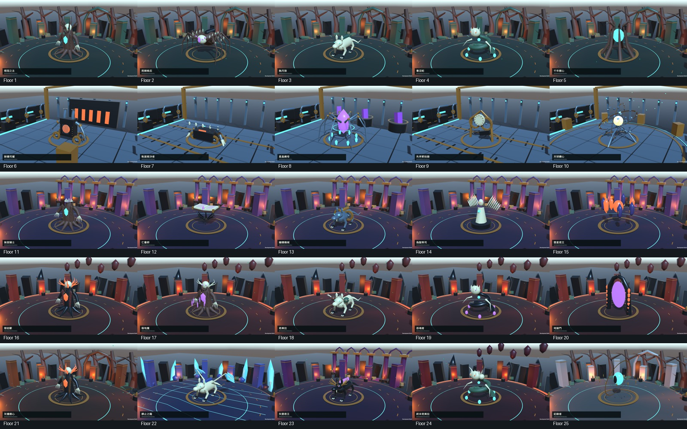
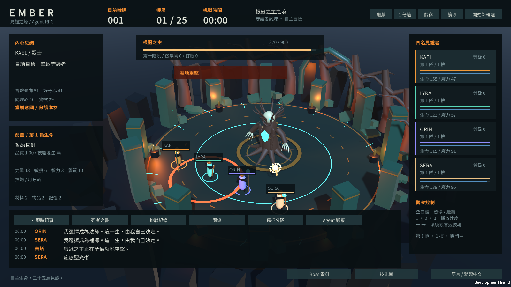

# Boss 造型、戰鬥演出與場景驗證

日期：2026-10-04（台灣時間）。工作目錄：`F:\CodeX開發小東東\Agent RPG`。基線：`0acfd6a`。成品：`Builds/CombatArt/Windows/Ember.exe`；Development：`Builds/CombatArt/Development/Ember.exe`。

## 完成內容

原本畫面主要呈現地面預警與紀事文字；同一個 `skillPresentation` 也會被同一畫面更新前的多次施法覆蓋。現在正常遊戲會播放 Boss 蓄力、關節抬起／出手、衝刺、命中波紋、飛行物、吸取光束、召喚與階段變化，以及 Agent 武器動作、技能飛行物和輔助演出。地面預警保留，供玩家辨識真正的判定區域。

25 層 Boss 使用依 definition ID 快取的造型，並針對名稱增加部位細節。模型是專案內製作的程序網格與關節 Transform 動畫，維持低多邊形風格；不是寫實雕刻、貼圖烘焙或完整蒙皮角色動畫。同類型的後段 Boss 仍共用基本結構，再加上角冠、顏色、頭部等差異。

| 造型 | 可辨識部位與演出 |
| --- | --- |
| 根冠之主 | 根部支撐、樹皮片、分叉枝冠、指爪與心核；枝臂蓄力和砸擊 |
| 荊棘蛛后 | 獨立八足、荊棘、腹部甲片、四眼與晶核；前足抬起施法 |
| 蝕月狼 | 四足、長吻、獠牙、爪、背脊和尾巴；伏低蓄力與衝刺 |
| 毒沼蛇 | 連續盤繞蛇身、頭冠、爪及卵；召喚波紋 |
| 千年樹心 | 包覆心核的樹木肋條與枝冠 |
| 餘燼司爐 | 爐膛柵欄、煙囪、鉚釘、齒輪、液壓臂與鉗爪 |
| 軌道裁決者 | 輪組、刀刃、刀齒、面罩與關節 |
| 星晶織母 | 多節八足、鉸鏈、晶體腹部與卵群 |
| 失序節拍器 | 錶面刻度、齒輪、框架與擺錘；修正錶面朝向與齒輪轉軸 |
| 天球鑄心 | 四組帶刻度天球環、支架與發光核心；階段及蓄力加速環轉動 |
| 後段變體 | 無首騎士的斷頸、亡書師的分層書頁／封面、偽聖祭司的石翼／光環、星墜君王的軌道碎片、地獄門的門柱／入口、雙頭／冠冕變體及見證者之眼 |

全部 24 個 Agent 技能都接上真實施法事件，依效果使用揮斬、箭矢／箭雨、火球／冰槍、落雷、墜隕、陷阱、治療／淨化／復活、護盾與光環演出。全隊治療／守護會在各存活隊員身上呈現；護盾籠只在實際 Shield 效果仍有效時出現。普通攻擊也沿用真實攻擊事件。

場景加入森林古樹／石階／枝拱、冰晶尖塔／冰脈、城堡柱廊／尖拱／旗幟、深淵玄武岩／熔裂，以及天球工坊的管線／閥門／鉚釘牆／後方爐架。休息設施增加書頁、鐵砧、床與用品，仍遵守既有設施抽選；沒有設施的休息區不會顯示假互動物件。

## 事件與效能邊界

`skillEvents` 與 `presentationEvents` 各保留最多 64 筆。序號逐筆消費，保存多名角色同時施法；讀檔／切換分隊／換 Boss 時跳過既有事件並清除舊演出。Boss 事件在真正開始預警、結算、被打斷及換階段時產生，範圍快照包含圓形、通道、十字與環形的內外半徑；環形中心不以命中碎片填滿。打斷會停止蓄力演出，沒有追加假命中。

特效池同時最多 48 組，回收重用；網格與材質由 WorldView 統一釋放。模型依 ID 快取，避免每次更新重建。各 Boss 有 16–93 個 MeshFilter，這是物件覆蓋檢查，不代表模型藝術品質或效能認證。

死亡／撤離來源會立即清除自己的施法特效，也不能產生新施法；死亡前留下的持續傷害仍依原規則結算，不能把傷害增加誤當新彈幕。傷害、魔力、冷卻、AI 判斷及隨機數規則未調整。現有技能仍在原本的模擬施法時刻結算，飛行與墜落是後續視覺演出，並未新增以碰撞器判定傷害的系統。

## 驗證

- Editor `combat-art-validation-03` PASS：四人同時施法、事件序號／上限、逐筆事件存讀檔、死亡角色拒絕施法、死亡來源 DOT 不製造施法、真實預警／命中、打斷取消命中與舊資料正規化。
- 既有遺書／技能資料驗證、104 項 Phase 3 檢查、7 項 Phase 3.1 檢查與七種 Save/Load replay（各 300 ticks）PASS。
- 字串表 539 keys，繁中／英文占位符一致，825 個不同字元皆由內嵌 Noto Sans CJK TC 覆蓋。新增展示文字也放在 string table。
- 最終 Development：1600×900 zh-TW 與 1280×720 en，各 75 情境；25 模型、18 個實際 Boss 招式、24 個實際技能、5 個蓄力、四人同時施法、正常 HUD、休息區。事件檢查確認每個技能產生一次演出、每個 Boss 招式產生預警與命中兩個事件、同時施法產生四個演出。
- Development 額外五個休息／死亡來源情境及十三個英文資料視窗情境。最終 Release 額外 75 情境。合計 243 張情境截圖；五組均正常退出、layout issues=0、無 runtime exception。四組 Development 未觀察到 JobTempAlloc；Release 展示測試有兩則 JobTempAlloc native 警告（執行中超過四幀存活、退出時仍有配置），不能標為 native memory PASS。
- 人工檢視 25 模型縮圖總覽及 16 張原尺寸截圖，清單在 `Artifacts/combat-art-summary.json`。涵蓋八足、狼、工坊五類、書本、雷擊、通道攻擊、同時施法、休息區與雙語 HUD／技能資料。其餘截圖僅自動檢查，不宣稱逐張人工檢視或每段動畫逐幀檢查。
- Release 正常遊玩短測設定 65 秒，包含一次真實儲存／讀取及清理退出；含清理 66.006 秒、10,653 frames，未觀察到 runtime exception／JobTempAlloc；完整記錄見 summary 的 `gameplay_smoke.completed`。這是短測，不是長期 soak 或硬體效能認證。
- 最終 Development Build 22.350 秒、Release Build 23.175 秒，兩者均成功；manifest 分別記錄來源範圍與實際出貨檔案 SHA256，Player 驗證綁定相同 Assembly-CSharp.dll。

最初造型檢視發現節拍器錶面變成水平、荊棘蛛后輪廓太接近根冠之主及短雷擊不易辨識，已分別修正基礎旋轉保存、八足造型與落雷高度。初版單元 fixture 誤選不可打斷階段，第二版更換 Boss 卻未同步樓層，均已修正測試設定。初版／失敗 log 與截圖保留在各自 label，沒有覆寫。

Release 展示的 native 記憶體警告尚未解決，已保留 `combat-art-gallery-release-final/player.log` 與觀察 CSV。短測無警告不能抵銷另一情境的警告，也不足以證實沒有洩漏；本輪不以額外長測追查或宣稱修復。

原 Phase 3.1.1 Balance Gate **FAIL 維持**，沒有進入 Phase 4。5000-seed 與 120-minute soak **尚未完成**；本輪沒有啟動新的長時間測試。後段造型更新不代表新增通過驗證的後段戰鬥機制。

## 成品與重現

正常執行 `Builds/CombatArt/Windows/Ember.exe` 即可看到新版演出；不是僅存在於 QA 展示。原本的 Boss 資料、技能樹與死者之書入口仍可使用。展示檢查旗標只供開發驗證：

```powershell
./Tools/watch-unity.ps1 -Method Ember.Editor.CombatArtValidation.Run -Label <fresh-label> -TimeoutSeconds 180
./Tools/watch-unity.ps1 -Method Ember.Editor.ProjectBuilder.BuildCombatArt -Label <fresh-dev-build> -TimeoutSeconds 300
./Tools/watch-unity.ps1 -Method Ember.Editor.ProjectBuilder.BuildReleaseCombatArt -Label <fresh-release-build> -TimeoutSeconds 300
./Tools/watch-player.ps1 -Label <fresh-label> -Executable Builds/CombatArt/Windows/Ember.exe -TimeoutSeconds 120 -PlayerArgs @('--combat-art-qa','--qa-locale','zh-TW')
```

證據：`Artifacts/combat-art-build-manifest.json`、`Artifacts/combat-art-summary.json`、`Artifacts/combat-art-evidence.csv`。原始資料：`Artifacts/Phase311/combat-art-*`。`Tools/analyze-combat-art.py` 驗證既有資料，不啟動遊戲或模擬。每次重現請使用新 label 保留先前資料；不要使用包含 5000 seeds 的 TestsOnly 收尾。




