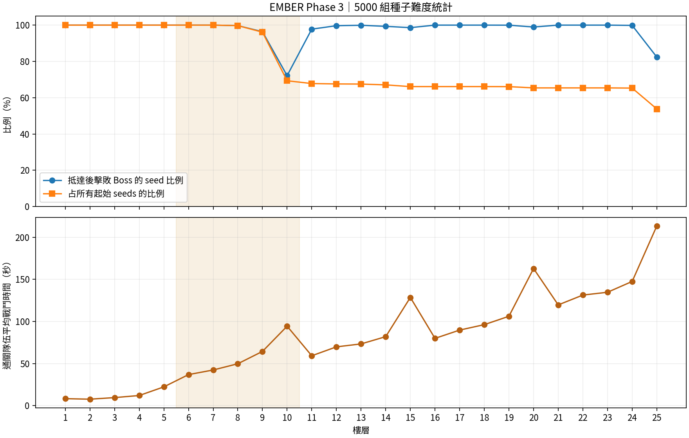

# 多維難度與種子調整

Phase 3 不以「樓層 × 常數」推導全部難度。作者指定 HP 節點，再分別指定攻擊傷害/間隔、AoE 幾何、位移、預警、階段組合、熱壓、恢復成本與協調需求。`FloorDefinition.difficulty` 是 6–10F 的設計向量，實際行為由 Boss/Ability/Phase/Rest 資料執行；向量不是額外乘上一套隱藏倍率。

## 模型

- Effective HP：HP ×（1 + armor × 0.08），護盾/無敵階段另外增加實際戰鬥時間，不能只用這個值代表完整耐久。
- Incoming damage / attack frequency：資料攻擊傷害均值與每秒施放頻率；是否命中由 cue、移動與防護決定。
- AoE / positioning：線、交叉與內外圈可用空間，軌道/鐘擺 Boss 移動及推移壓力。
- Reaction window：最短預警秒數，與角色移動速度、場地尺度及連續出招一起解讀。
- Complexity：不同能力數、階段條件及多目標互動，不與傷害直接等價。
- Resource attrition：熱壓、法力抽取、法力恢復速度、藥水、休息時間及撤離預算。
- Build / coordination：輸出、元素、打斷、召喚物清除、團隊恢復與離隊後失去支援。

## 設計目標區間

下列是診斷區間，並非強迫每層達到某個固定勝率。以「抵達該層的 seed 中至少一隊通過」衡量樓層條件通關率；角色死亡比例、剩餘人數與時間另行檢查。

| 區域 | 目的 | 原型診斷區間 |
| --- | --- | --- |
| 1–5 | 建立配置與熟悉撤離 | 條件通關約 95–100%，容許少量個體死亡 |
| 6–9 | 爐道、移動、資源與連續決策 | 約 90–100%，應出現個體損失與恢復需求 |
| 10 | 區域綜合檢查 | 約 80–95%，平均戰鬥時間高於前幾層，有可讀的三階段 |
| 11–15 | 配置與資源規劃 | 約 85–100%，首層較 capstone 放鬆，逐漸提高 |
| 16–20 | 高壓與協調 | 約 80–98%，失去支援的單人隊有更大風險 |
| 21–24 | 精熟檢查 | 約 75–95%，檢查前一區到新區有無死亡突增 |
| 25 | 綜合檢查 | 約 65–90%，仍允許非典型編成通關 |

11–25F 內容仍有佔位，這些區間需要後續專屬內容與更廣種子校正；超出區間不是自動測試失敗。

## 基線發現與調整

原 Phase 2 的 1000 seeds 全通關且沒有個體死亡。1F 約 3.9 秒結束；6–10F 仍約 15–22 秒，幾乎沒有受傷。約 99.9% 的 1F encounter 出現分隊，主要是不同時間撤離立即拆隊，而非有意義的策略分歧。

調整一般撤離的等待窗口，仍保留腦袋明確離隊與接近坍塌時獨立推進。提高前五層耐久以保留機制出手機會；6–10F 加入專屬能力與逐層熱壓。降低基礎法力恢復，提高 MP/休息/回能詞綴的價值。240 秒後逐漸提高狂暴壓力，避免恢復策略永久消耗戰；不是到某一秒無預警瞬殺。

在調整過程找出「0.1 秒持續傷害被最少 1 點傷害放大」的問題，修正玩家與 Boss 持續傷害的 dt 計算。能力與爆發傷害仍使用原基本護甲/防護計算。

掉落保證可立即使用的職業武器，帶灼印、軌行、凝能、破甲或星核詞綴；灼印/星核可提供跨職業灌注。打造有更高基礎品質與可控灌注，AI 不只比較原始 power，也估價詞綴與法力需求。

初步 100 seeds（最終微調前）65 通關 / 35 全滅；這是調整樣本。先前 1200 組快照也保留，最終分析改採全部 5000：2690 通關 / 2310 全滅 / 0 未終止。逐層資料見 `Artifacts/phase3-final-analysis.csv`。

| 層 | 抵達 seeds | 擊敗 Boss | 通關平均秒數 | 死亡事件 |
|---|---:|---:|---:|---:|
| 6 | 5000 | 100.0% | 36.8 | 33 |
| 7 | 5000 | 100.0% | 42.3 | 27 |
| 8 | 5000 | 99.7% | 49.7 | 426 |
| 9 | 4986 | 96.4% | 64.4 | 1499 |
| 10 | 4805 | 72.2% | 94.3 | 4636 |
| 25 | 3265 | 82.4% | 213.4 | 2315 |

10F 較 9F 的條件擊敗率下降 24.2 個百分點，低於 80–95% 目標。優先查三階段熱壓、法力抽取、召喚/護盾與恢復資源，不以簡單增加 HP 處理。25F 比例只代表抵達者，存在存活者偏差；11–25F 多層仍是佔位，不能從通關框架推論內容完整。

## 解讀方式

分析工具標記零死亡樓層與條件通關率下降超過 15 個百分點的樓層，並輸出技能使用、職業/武器 exposure。零死亡可能是教學成功，不一定要提高傷害；高壓 capstone 後放鬆也是可接受的節奏。已執行四戰士、四弓箭手、四法師、四補師與四職混合隊各 50 組相同種子；比較終點是至少一隊離開 10F 抵達 11F。這是小樣本起始編成控制，不是技能消融或完整因果試驗。

Telemetry 的倖存數與品質取戰鬥結束快照；死亡/休息事件可在之後更新。所有百分比的分母與抽象限制見 PHASE3_CONTENT_PIPELINE.md。

## 起始編成控制組

| 編成 | 抵達 11F / 50 | 全滅 | 未終止 | 平均模擬秒數 | 平均存活者 |
|---|---:|---:|---:|---:|---:|
| 四戰士 | 2 | 48 | 0 | 559.84 | 0.06 |
| 四弓箭手 | 1 | 49 | 0 | 502.97 | 0.02 |
| 四法師 | 0 | 50 | 0 | 607.54 | 0.00 |
| 四補師 | 50 | 0 | 0 | 584.00 | 4.00 |
| 四職混合 | 50 | 0 | 0 | 521.04 | 3.98 |

四補師與混合隊全數抵達，而其他三種單職隊僅 0–4%，顯示本樣本嚴重依賴恢復/編成。四補師同時保有足夠輸出與全部存活者，優先檢查治療續航、祝聖輸出、法力循環及非補師的恢復機會；未做消融，不能將差異歸因至某一招技能。上述平均秒數含前十層戰鬥與休息，失敗隊常提前結束，不能將較短秒數解讀為較高效率。25F 條件通關 82.4% 在診斷區間內，但只代表已抵達者。

## 自然技能與角色暴露

24 技能的效果斷言與自然 AI 使用不是同一件事。完整使用次數：

cleanse：62773、counter：113054、enchant：303907、fireball：571238、frost：228868、groupheal：7867、guard：6980、heal：1416014、holy：3295261、lightning：68689、meteor：69558、pierce：117501、poison：488417、rage：30101、rain：80573、revive：8、shield：18190、shot：119128、slash：1646849、snipe：60478、taunt：68、trap：11298、ward：102428、wave：137343。

嘲諷 taunt 使用 68 次、復活 revive 使用 8 次；若使用稀少，需檢查解鎖/配置/AI 時機，不能只憑效果斷言認為自然決策已充分運用。

| 職業 | Encounter exposure | 傷害 / exposure | 治療 / exposure |
|---|---:|---:|---:|
| 法師 | 86921 | 2778.6 | 20.7 |
| 補師 | 117683 | 3832.3 | 451.2 |
| 戰士 | 97576 | 3119.6 | 4.9 |
| 弓箭手 | 92439 | 4146.0 | 13.9 |

分母是角色分隊樓層暴露，樓層、武器與存活時間不同；補師傷害高或某武器 exposure 少，不能直接判定過強/過弱。死亡含復活後再次死亡，平均戰鬥秒數只計 Clear encounter。原始品質快照包含全滅歸零與不含完整詞綴價值的限制。
