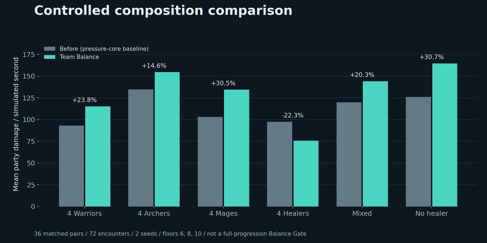

# Engineering evidence · 精選驗證

Latest gameplay evidence belongs to Team Balance (43a2f70), not to subsequent documentation-only commits. Historical results are not silently promoted to the latest build.

| System | Challenge | Implementation | Evidence and limits |
| --- | --- | --- | --- |
| Agent decisions | Illegal actions or network delays affecting simulation | Bounded DTO, validation, local fallback | Architecture/source inspection; do not claim latest full LLM production verification |
| Party split | Shared Boss HP or duplicate ownership | Independent Group state, safe-point rejoin | Implemented and historically exercised; no latest full-progression rerun |
| Memory | Observer information leaking into Agent knowledge | Source tags, witnessed abilities, explicit Book reading | Latest knowledge UI captures; historical memory/split tests separate |
| Save/load | A readable save that diverges after restore | RNG/state serialization and continuation comparisons | Included in latest team/pressure regression checks; not a cross-platform guarantee |
| Localization | Missing CJK glyphs and stale language text | String tables, embedded CJK font, runtime language switch | 638 keys / 895 glyphs checked; final UI fixture samples |
| Combat pressure | Health loss with no clear actionable source | Destructible warned spatial cores and threat detail | 21 pressure regressions; core/gallery fixtures |
| Party balance | Wrong stat scaling, healer dominance and duplicated support | Shared scaling, reservations, role slots, defensive coordination | 22 team checks and matched fixture below |
| Builds | Mistaking a hung build or old executable for success | Bounded watchdog, exit marker, source/assembly hashes | Development + Release completed for the latest revision |
| Performance | Short clean windows mistaken for a long-soak guarantee | Preserve warnings, process state and version binding | Latest short UI windows recorded no JobTempAlloc; latest long soak not run |

## Matched controlled comparison

Two seeds (1729, 1730), floors 6/8/10, six compositions. Each version ran 36 encounters; 72 are compared. Both used controlled attributes, quality-1.15 weapons and fixed four-skill loadouts with real Boss abilities. Each encounter was bounded to 180 simulated seconds; the benchmark batch had a 60-second wall-time cap.

| Composition | Before DPS | After DPS | Change | Before / after end MP |
| --- | ---: | ---: | ---: | ---: |
| Warrior | 93.1 | 115.2 | +23.8% | 16.1% / 21.2% |
| Archer | 134.9 | 154.5 | +14.6% | 26.8% / 23.1% |
| Mage | 103.0 | 134.4 | +30.5% | 20.1% / 17.0% |
| Healer | 97.5 | 75.8 | -22.3% | 93.6% / 93.5% |
| Mixed | 119.8 | 144.0 | +20.3% | 37.8% / 37.2% |
| NoHealer | 125.9 | 164.5 | +30.7% | 19.3% / 21.5% |

All six samples per composition per version cleared and ended with four living members. Mean DPS is the mean of each encounter's total damage divided by its duration. MP is the mean end-of-encounter remaining fraction. These are fixture results, not natural progression win rates.

**Interpretation:** Mixed DPS increased 20.3%; the no-healer composition remained faster. Healer-only DPS fell 22.3% as support became its focus. Mage output increased but end MP fell, so “mana sustain improved everywhere” would be false. Much of the reduced overheal metric reflects removal of zero-effective Holy recovery records at full health, not equal mana savings.

The latest revision has 43 mechanism/regression checks (22+21), two successful Builds and 52 final UI screenshots across two sizes. Automated layout checks recorded zero issues; four Player logs recorded no exception or JobTempAlloc warning. Representative UI captures were visually reviewed. This does not certify every untested screen or long-session performance.

## Published data

- [Sanitized summary and runtime/assembly hashes](../Evidence/team-balance-summary.json)
- [Composition comparison CSV](../Evidence/team-balance-comparison.csv)
- [Screenshot provenance](../Media/Portfolio/PROVENANCE.json)

The original development history is preserved in this repository. These selected summaries provide a concise entry point; older tracked validation records remain available, with their historical scope. Ignored raw logs, machine-level audit reports, caches and local builds are not uploaded.

**Not rerun for this revision:** full Balance Gate, 5000-seed simulation, 120-minute soak. The historical failed Gate remains a failure; screenshots or a successful Build cannot override it.
