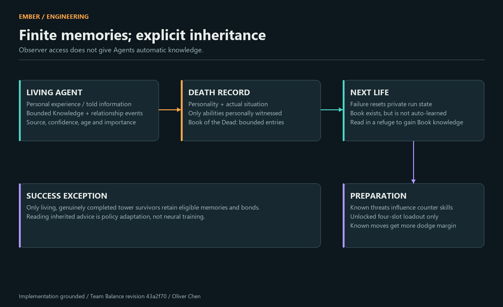
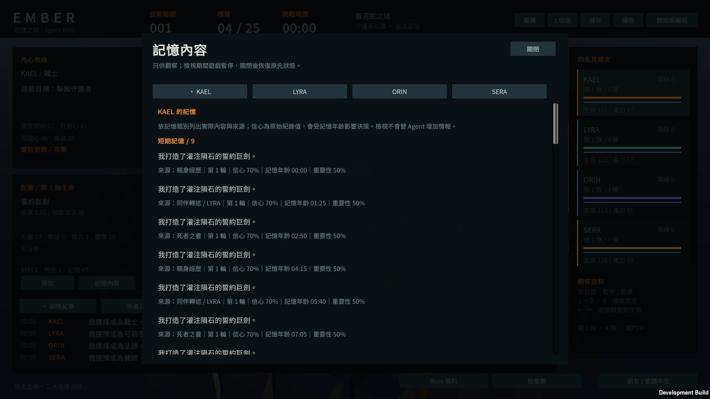
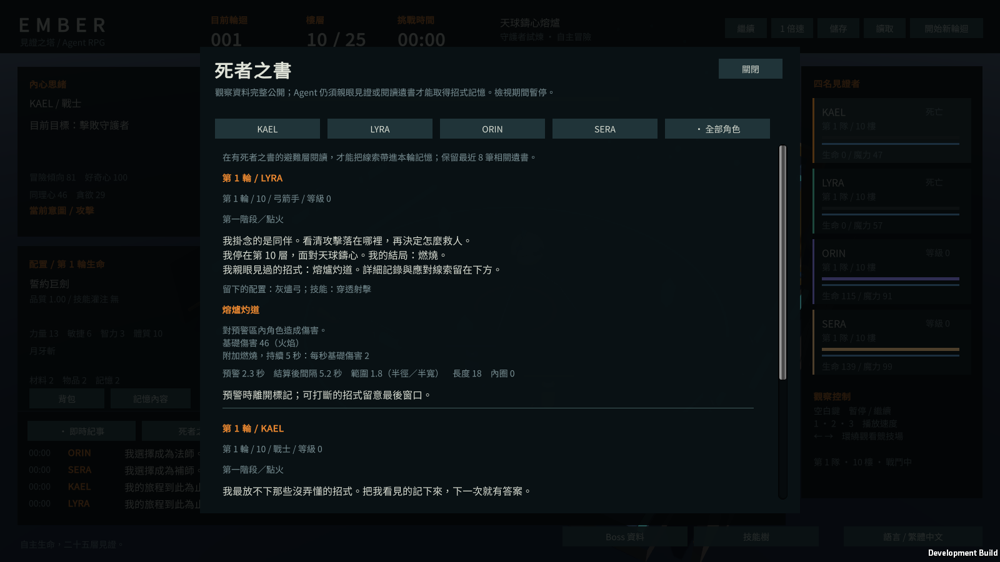

# Memory and relationships · 記憶、遺書與關係

The system distinguishes experiencing, being told and reading an inherited record. Information in an observer UI is not automatically knowledge available to an Agent.

## 記憶內容與來源

每條 Knowledge 包含 key、內容、scope、source、run、informant、confidence、age、importance 與 emotionalWeight。來源分為 OwnExperience、BookOfDead、ToldByAgent；記憶範圍分為 Working、Run、Relationship、LongTerm、Survivor。

相同 key／scope／source 的記憶會被更新。每名角色最多保留 48 條，超出時優先移除 Working，再移除較早項目；顯著關係事件另有最多 12 條的限額。這是有界資料模型，並非向量資料庫或無限對話記錄。

## 死亡不是「全記憶繼承」

一般失敗的新輪迴會清除私人記憶、成長、裝備與當輪關係。Book 保留有限遺書；只有真正完成高塔且存活的個體才能保留適用的長期／生還者記憶與關係。

遺書依主要人格傾向、死亡樓層、Boss、階段、職業、裝備與技能生成，並記錄實際親眼見證的招式。沒有觀察到的招式不補成「已知」。Book 保存最近 64 條；讀取時優先相關 Boss 與較新的遺書，最多選 8 條，每條至多取 6 個有效招式資訊。

閱讀會新增 BookOfDead 來源的知識。面對相關 Boss 時，已解鎖的防禦／淨化／範圍技能可被準備到四個欄位內；已知招式增加閃避安全餘裕。遺書會影響政策，但不保證通關，也不表示資料庫外的角色知道全部 Boss 招式。

## 有方向的社會記憶

施救、治療、分贓、拋棄、戰術成敗、死亡與重聚會更新關係。事件保存 actor、subject、時間、輪迴、kind、magnitude 與 evidence，讓「為什麼信任下降」可以被觀察。

目前關係維度包括 Trust、Respect、Friendship、Love、Fear、Resentment、Loyalty、Rivalry。它們有數值邊界與可調權重；不是語意理解或心理學模型的實證結論。

[Decision logic](AGENT_DECISION_LOGIC.md) · [Algorithms](ALGORITHMS.md) · [Case study](PORTFOLIO_CASE_STUDY.md).
