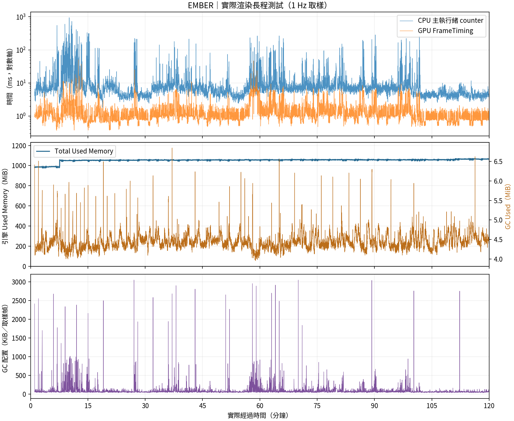

# Phase 3 效能與原生配置診斷

2026-10-03，在 F 槽完成 **120 分鐘實際渲染壓力測試**。Windows / Unity 6000.2.0f1 / D3D12 / RTX 3070 Ti Laptop（8 GB）。Development Player 使用凍結 Runtime，16 倍速、分鐘存讀檔、輪替觀察、五分鐘死亡/坍塌；同機同時執行 headless seed runner，前段也有 Release 建置/畫面 QA。這不是單獨的一倍速效能基準，數字不能直接當作正常遊玩幀率。

## 完整量測

complete marker：`elapsed=7200.005; rows=6975; runs=60; maintenance=119`。session 起始時間、30/60/90 分鐘存檔、frames.csv 及 Player log 保存於 `Artifacts/Phase3/soak-relocated-120m`。原始資料不納入 Git，搬移時必須保留。有效渲染最後秒數、排除列數及完成標記見 `Artifacts/phase3-soak-relocated-120m-performance.md`；統計工具只接受物件≥100、draw calls>1 的取樣，排除暖機前 60 秒。counter 偶爾為 0/NA 不等於已證實黑畫面，共排除 36 筆無工作負載/無效 counter 列，不全是啟動或清理；最大有效取樣間隔 22.17 秒，不能宣稱逐幀連續無缺畫面。另保存 coverage 稽核。

| 實際窗口 | 取樣數 | Frame p95 ms | CPU p95 ms | GPU counter p95 ms | GPU FrameTiming p95 ms | GC 平均 bytes/取樣幀 | Used Memory 首→末 MiB |
|---|---:|---:|---:|---:|---:|---:|---|
| 1–30 分 | 1655 | 139.31 | 86.98 | 3.00 | 3.22 | 120878 | 986.9→1057.3 |
| 30–60 分 | 1746 | 60.59 | 17.68 | 5.39 | 5.53 | 102663 | 1058.4→1055.9 |
| 60–120 分 | 3479 | 42.41 | 19.74 | 4.09 | 4.64 | 91621 | 1057.3→1065.5 |

1 Hz 百分位描述取樣幀，不是所有幀。CPU counter 與 GPU FrameTiming 的擷取點不同，不能逐列相減推算瓶頸。NA 是無法取得，沒有改寫成 0；GPU counter 的 0 仍是原始 counter 值，另列 FrameTiming 作參照。ai_ms 包含整段 tick loop，save_ms/telemetry_ms 保留最近一次維護成本，不是每一幀都執行存檔。更完整均值、最大值與資源/IO 數據保存在 JSON 摘要。

資源物件有上限，但 GC 仍持續配置；Used Memory 是引擎總 used counter，不全是 native、也不是 OS Working Set。暖機之後約 1 GiB 的平台不能證明零慢速洩漏。CPU/frame p95 尖峰尚未達到穩定低延遲目標；後續需要固定場景、同速、獨立負載與 allocation call stack，比較才可宣稱優化比例。

## 執行期間警告仍未解決

本次完整 log 共 **8 次 JobTempAlloc 警告**，退出前已確定至少 6 次。native allocation diagnostic 輸出包含 48-byte allocation 與 UnityPlayer 位址，但未取得引擎完整符號/精確配置呼叫點。原始 stack 及退出前後觀察保存於 `Artifacts/phase3-jobtemp-longrun.txt`。退出清理另有 remaining-allocation 警告，引擎 MemoryLeaks 診斷 allocatedMemory=150443 bytes；未歸因到專案的精確呼叫點。log 缺少逐警告 wall-clock timestamp；frameIndex/age 不能用來推定警告發生在第幾分鐘。

下面的最小 ParticleSystem 對照只證實可重現的退出路徑與 workaround，**不能解釋所有長測 runtime 警告或宣稱全部解決**。未升級 Unity，也未擅自移除所有粒子。完整長測執行完成，不等於原生配置驗證無警告通過。

## 已採取的措施

- 觀測狀態重用，減少完整 JSON 複製。
- 角色特效最多 64 個；五種工坊 Boss / 場景快取；控制區最多 8 個。
- 自建 Mesh、Material、AudioClip 的生命週期明確；關閉時清空粒子、銷毀世界與資產並等待清理。
- IMGUI 與高階決策有 profiler marker；長測使用實際渲染、分鐘存讀檔、輪替觀察及死亡/坍塌情境。

這些是有界資源與量測基礎，沒有完成完整 allocation call stack 分析，也沒有最終音畫內容效能保證。

## JobTempAlloc 隔離結果

專案搜尋沒有自行配置 NativeArray、NativeList、TempJob 或排程 JobHandle。最小 Player 對照：空場景、Camera、Camera + Mesh 各 0 警告；加入 ParticleSystem 後 Development 退出有 2 次警告。相同 Release 的兩次對照，未清理粒子均 1 次，StopEmittingAndClear、銷毀後等待兩秒均 0 次。正式 UI 測試兩種解析度退出均 0 次。原始計數見 `Artifacts/jobtempalloc-tests.txt`。

這足以將可重現路徑縮至 **Unity ParticleSystem 退出生命週期**，不是證明取得引擎內部精確配置呼叫點。[Unity UUM-113839](https://issuetracker.unity3d.com/issues/memory-leak-warnings-are-thrown-when-creating-a-particle-system-gameobject-2) 記錄 6000.2.0f1 的 ParticleSystem 洩漏警告，6000.2.6f1 修正，與隔離結果一致。未升級 Unity，也沒有聲稱修正封閉引擎本體；本專案提供明確清理 workaround，後續應升級並重跑對照與長測。舊診斷版本關閉仍有警告，文件保留失敗紀錄。

## 歷史診斷與後續

中間 Build `soak-120m` 實際約 31.4 分鐘，最後 Runtime 的先前短測 `soak-frozen-120m` 約 296 秒；這些原始 log/CSV 和摘要保留，沒有冒充完整時長。修改前 `before-pooling` 約 179 秒，情境不同，不能用 CPU 差值宣稱優化比例。舊 OnGUI 清理後 Camera 例外保留於歷史 log；退出流程後續以停止更新、清理、延後離開改善。

優先處理 runtime JobTempAlloc、UI 動態字型像素缺漏及尖峰；評估 Unity 已修正 patch 後再以相同 workload 對照。逐幀 GC stack、獨立單機 CPU/GPU benchmark 和正式美術音畫成本仍待驗證。本輪到此收尾，不啟動新的長測。
