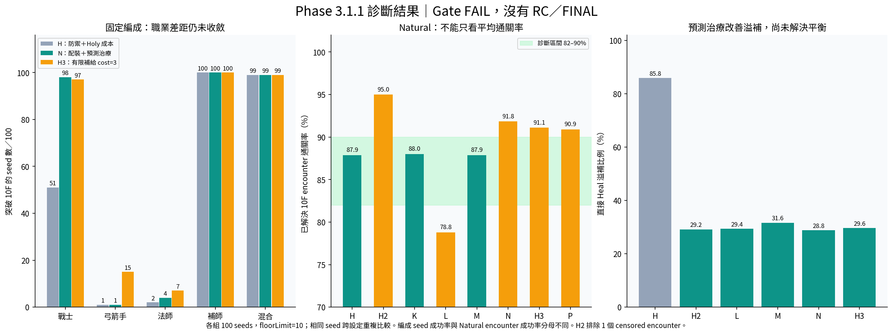

# Phase 3.1.1 — Recovery / Build Pipeline / Balance Gate

**收尾完成，Gate FAIL：H3 仍未通過職業組成平衡，沒有正式候選，也沒有進入 Phase 4。已停止測試，等待下一步。**

工作目錄：`F:\CodeX開發小東東\Agent RPG`。原始紀錄、screenshots、checkpoint、process samples 保留於 `Artifacts/Phase311`；本文件及根目錄分析 CSV 納入 Git。舊 Phase 3／3.1 cohort 不冒充新版結果。

## Build pipeline 與 ILPP

Unity 6000.2.0f1。凍結版 candidate-A / P3.1.1-A 已連續完成三次 Compile Only，其中第三次以 Editor 原始碼註解改動觸發重新編譯；每次約 5.6 秒、正常 assembly reload／退出。Editor validation、Development、Release 均成功；詳細 PID／CPU／memory／IPC／cache／log／時間見 `Artifacts/phase3_1_1_build-recovery.md`。

沒有刪 Library、沒有更換 Unity、沒有調整 worker priority。觀察到 BelowNormal ILPP worker、named pipe 存在，並有真正的 Csc／reload／build 成功證據。**前輪停滯的精確根因未重現、未證明。** 重查舊 log 發現先前「完全未編譯」的說法過度：曾有成功 Csc／reload，但沒有成功 Player Build。

watchdog 同專案互斥，30 秒輸出 CPU delta、log growth／mtime、stage、PID、IPC，保留 stdout／stderr／process tree。閒置警告 120 秒、CPU 及 log 皆無進度達 420 秒才判 STALLED；另有總時間上限。exit 0 還需成功 marker。續測另發現退出後 log 的寫入 handle 尚未關閉，使 wrapper 的 `File.ReadAllText` 發生 sharing exception；已改用允許 concurrent writer 的讀取。該次 Editor log 有 build marker／正常 code 0，但不冒充當時 wrapper 完整 PASS。另一次新增診斷的 C# 型別錯誤已修正，watchdog 有如實 FAILED。EXP2.1 第一次 smoke 因建置 log 混合編碼導致設定檔未產生，錯誤啟動後大量 null-texture warnings；已安全終止，保留 1.28 GB log，列 FAILED，不計成功樣本。Player wrapper 現在啟動前驗證設定檔／JSON，啟動例外及 64 MB 日誌量上限會終止測試，避免再次無界增長。

## Build identity 與 Windows smoke

candidate-A 的 source／exe／managed／data 完整 SHA：`Artifacts/phase3_1_1_build-manifest.json`。新實驗成品各自放在 EXP1、EXP2 等資料夾，沒有覆寫凍結的 A。

Source runtime hash 只涵蓋 Core 文字與 Resources JSON；**不等於 Player assembly hash**。實測多個 Development Player 的 Ember.exe SHA 相同，但 Assembly-CSharp SHA 不同，因此必須同時檢查 assembly／config／runtime。EXP1 binding 見 `Artifacts/phase3_1_1_exp1-build-binding.json`。

candidate-A、EXP1、EXP2 都完成可見 Windows Player 五分鐘 smoke、正常退出；EXP1／EXP2 有正常遊戲進行後的 zh-TW → en → zh-TW 截圖。Main／1F／Rest／Boss／Save／Load／10F 另以 Player fixtures 覆蓋，不能宣稱五分鐘自然遊戲走完整個高塔。後續修正的版本需各自驗證。

## 10F 消融、選擇與組成

EXP1 每組 100 seeds，Natural、firstSeed=1、floorLimit=10。A–G、兩組 control、MP window／配裝隔離及 H 共 1,200 seeds；固定編成各 100，合計另 500 seeds。共 **1,700 完整新版診斷樣本**，nonterminal=0；它們不是正式 1000 regression。

| 組別 | 10F 擊敗／encounters | 診斷比例 |
|---|---:|---:|
| 原版 control | 78 / 99 | 78.79% |
| candidate-A control | 96 / 100 | 96.00% |
| A：僅 5 秒低壓窗口，不含 MP regen | 78 / 99 | 78.79% |
| B：僅降低 MP drain | 78 / 99 | 78.79% |
| C：窗口＋drain | 78 / 99 | 78.79% |
| D：提前使用藥水 | 74 / 97 | 76.29% |
| E：保留 MP | 74 / 96 | 77.08% |
| F：診所有限補給（上限 2） | 95 / 101 | 94.06% |
| G：防禦 AI，不強制 role 配裝 | 87 / 99 | 87.88% |
| I：窗口＋窗口 MP recovery | 81 / 99 | 81.82% |
| J：僅 role 配裝 | 75 / 98 | 76.53% |
| H：防禦 AI＋Holy 恢復成本 | 87 / 99 | 87.88% |

原始 manifest／config、Wilson interval、deaths、MP、TTK、potions、paired seeds 見 `Artifacts/phase3_1_1_exp1_*.csv`。Natural 可分隊，encounter 不是 seed；這些組別的 10F Active/censored 都為 0。floorLimit=10 只追到第一隊超過 10F，不等同 25F 全輪終局。成對比較：F 相對 baseline 新增 18 個成功 seed、損失 1；G/H 新增 9、損失 0。小樣本不是 90% 精準校準的證明。

H 固定編成突破 10F：戰士 51/100、弓箭手 1/100、法師 2/100、補師 100/100、混合 99/100。法師只有 38 encounters 到 10F，弓箭手 65；不能隱藏較早樓層的失敗。**H 未通過組成 Gate，不得僅依 Natural 88% 正式化。** 尚未調整 Boss HP／raw damage，也沒有削弱全體補師傷害。下一步隔離有限存量補給、role 配裝與預測治療。

## EXP2.1 後續診斷（尚未正式化）

目前 runtime `593eb2559149e06de985e51d08e50a138c1e4354bd2ed2dbfc2d2eb5b17412bf`，Development assembly `14091e0cfd350761df20a117a62db9bb3692b30057370fd935d098b991de9363`。全部以 manifest 綁定；Editor pure simulation 不是 Windows Player 實機平衡測試。

H3／預測治療仍是明確 CLI config 的實驗，不是預設產品平衡。一般啟動的 CoreRules 保留凍結 candidate-A，predictiveHealing 預設 false；本輪 workload 才以 `--balance-config` 指定 H3。沒有把被淘汰的 H3 靜默設為預設，也沒有用 R1 assembly 重新標記舊 seed-runs。

| 組別（各 100 seeds） | 10F 已解決 encounter 通關率 |
|---|---:|
| H control | 87/99，87.88% |
| H2：有限補給＋role＋預測治療 | 95/100，95.00%（另 1 censored encounter） |
| K：僅 stock=1 有限補給 | 88/100，88.00% |
| L：僅預測治療 | 78/99，78.79% |
| M：H＋預測治療 | 87/99，87.88% |
| N：role＋防禦＋預測治療，無 kit | 90/98，91.84% |
| H3：H2 kit cost 1→3 | 92/101，91.09% |
| P：K kit cost 1→3 | 90/99，90.91% |

N 固定編成各 100：戰士 98、弓箭手 1、法師 4、補師 100、混合 99 個 seed 突破 10F。弓箭手只有 65 encounters、法師 48 encounters 到 10F，早期死亡不能排除。**N 不符合組成 Gate；H2 過強。** H3 固定編成突破 10F：戰士 97/100、弓箭手 15/100、法師 7/100、補師 100/100、混合 99/100。法師到 10F 的 82 個 encounters 僅 7 成功；弓箭手到 10F 的 97 個僅 15 成功。H3 同樣未通過組成 Gate，沒有合格候選升級 RC；不啟動下一階段 500／1000／5000。

H control Heal direct overheal 85.84%；H2 29.16%、L 29.35%、M 31.64%、N 28.76%。H control 2,329 次 Heal、1.43 effective HP/MP；H2 1,004 次、7.31 HP/MP。改善來自減少無效瞬發治療，不是砍 Healer 傷害。資料涵蓋 1–10F 各職業組合的直接效果，不能當成單獨四補師的技能效益。

有限補給的代價實際可量測：H control 100 seeds 材料支出 7,733／生成推估 13,915／剩餘 6,982，HP/MP potion 使用 242/833；H2 為 10,320／14,128／4,608，261/1,902；H3 為 11,816／14,070／3,054，277/1,704。kit 成本增大降低剩餘資源與 MP potion 使用，但 H3 仍約 91%，不足以單憑付費證明平衡良好。生成量由初始＋支出＋終點庫存守恆推算，包含 salvage／overflow，未宣稱純掉落量。

加計 H3 固定編成，共 3,500 個完整新診斷 seed-runs：EXP1 1,700，EXP2.1 Natural 800、N 固定 500、H3 固定 500。相同 seed 跨 config 成對使用，**不是 3,500 unique seeds，也不是正式 1000 safety regression**；floorLimit=10 的非終局樣本不能替代 25F regression。根目錄 CSV 提供完整 runtime/config/exe/assembly SHA、Wilson interval、消耗與存量。

H3 四補師固定 100：Holy 47,090 casts，1,595,859 direct damage／520,445 effective HP／255,503 MP，6.25 damage/MP、2.04 HP/MP、23.87% overheal；Heal 198 casts，10,510 effective HP／1,584 MP，6.64 HP/MP、35.19% overheal；基本攻擊 92,534 次、3,385,563 damage／0 MP。Holy 並不是唯一傷害來源，基本攻擊提供更多直接傷害；Holy 的同時恢復與短 CD 使其維持續航。cast time=0，不把 3 秒 cooldown 算成失去基本攻擊的 3 秒。直接恢復/CD 的比值是技能容量，不能冒充實際整場 HP/sec；travel 含嘗試而非僅成功施放。

H3 純弓箭／法師每 encounter 消耗約 3.68／3.58 瓶藥，四補師只有 0.11；四補師仍剩 5,839 材料、1,002 HP potion／909 MP potion，而法師只剩 2,129 材料、25／11 瓶。四補師確實支付 MP 與站點費用，但相對其他職業仍是極低耗損的穩定路徑，**不宣稱「四補師不是無代價最優」Gate 已通過**。未用無差別 DPS nerf 掩蓋 AI／恢復差距。

## Recovery economy 與 HolyAttack

EXP1 Natural 1–10F：baseline Holy 10,402 casts，389,191 direct damage、139,420 effective healing、41,608 MP，9.35 damage/MP、3.35 HP/MP。A control Holy 10,372 casts，386,692 damage、141,308 healing、59,308 MP，6.52 damage/MP、2.38 HP/MP。CD 3 秒、cast time 0；實際移動時間另記錄，冷卻不等於禁止基本攻擊的時間。

baseline Heal 2,412 casts，32,086 effective HP／19,296 MP，83.54% direct overheal；A control 1,311 casts，23,677 effective HP／10,488 MP，78.18% overheal。這與四補師舊樣本 81% 的分母不同，不能混用。Holy 在造成傷害的同時，對最缺血者提供小額治療；低 overheal、3 秒 CD，以及 Wis 同時影響輸出／治療／被動 MP recovery，使它成為續航來源。需要先改善 Heal timing，再判斷技能 tradeoff。

施放 opportunity cost 的限制：`ExecuteCombat` 在 Skill intent 時不執行基本攻擊，射程外移動與等待下一次 tactical decision 也可能延後攻擊；不是整段 cooldown 都禁止攻擊。已量測 cast_time=0、成功施放 CD、travel（含失敗嘗試），但「本可攻擊卻因 Skill intent 而錯失的次數／傷害」未另外計數，明確 NOT VERIFIED，不把三者加總冒充完整 opportunity cost。

目前其他 Healer damage skill 只有基本武器攻擊；技能表沒有第二個純輸出職業技能。EXP1 未獨立量測基本攻擊，EXP2 新增 direct BasicAttack 次數／傷害／間隔及移動成本。延遲 Regen／DoT 另外記錄，不把它們算成當次瞬發效果。Holy 的有效恢復最多額外耗 2 MP，沒有改動其傷害／基礎治療值。武器 Staff 的基本攻擊也依 Healer Wis 縮放，因此同一屬性同時影響 Holy、基本攻擊與 MP recovery；續航不能只歸因於 Holy 混合效果。

新增材料實際支出、rest agent-seconds、seed 終點 inventory 及初始材料。藥水／clinic 非無限：每層站點訪問有上限，補給仍支付正常站點費用、額外 kit 費用、旅行與工作時間，且 10F 後不補 kit。EXP2.1 cohort 的實際支出與庫存見上表；原 EXP1 缺少完整欄位，沒有以 code inspection 補造舊數據。

舊分析把 RestRisk exclusion 寫成 `id != RestRisk`，但實際 key 是 `RestRisk:`；已修正並另產生 `phase3_1_1_corrected_legacy_*`，保留舊報告／raw files。

## Heal AI 與 Revive

預測治療為 opt-in 實驗：依實際 stat-scaled 治療量、移動後預期缺血、可見預告、Burn／Doom／hazard／adds／pressure、防禦與既有 Regen，評估有效治療、overheal penalty、急迫性及移動成本。瞬發在射程內不把未來傷害冒充當下缺血。滿血／只缺 1 HP 不耗魔，危急目標仍可治療，已做可執行 fixture；EXP2.1 cohort 已量測 direct overheal 明顯下降；結果見上表。

Revive 使用十項 boolean 觀察與 joint eligibility，按 pattern／reason 累計 seconds／samples：dead target、healer alive、unlocked、equipped、CD、MP、range、LOS、danger、still revivable；包含 NO_TARGET／NO_MANA／OUT_OF_RANGE／COOLDOWN／DANGER／NOT_EQUIPPED／PRIORITY／EXPIRED 等原因。LOS 無障礙機制，因此依目前模型為 true，不是物理 raycast 驗證。

Recovery validation 原本 11 個復活條件檢查，再加入治療／economy／正常 Step AI revive，16 checks PASS（目前 EXP2.1 runtime）；包含滿血瞬發不可預先扣魔、少量缺血不浪費治療、急迫治療、direct economy，以及復活正向與阻擋條件。正常 Step 中 AI 自己選擇並復活隊友，有 ATTEMPT 與真正 `Revive` recovery 證據，沒有只手動呼叫 Cast 就宣稱 AI PASS。

EXP1 H／A Natural 與固定補師／混合 cohort 的觀察只有 NO_TARGET，joint eligible seconds=0。A control 有一次 skill id `revive`，recovery source 卻是小寫 `revive`：它是對活人治療，**不是真正復活**。無實際目標不能反推 AI 忽略救援。EXP2.1 Natural 與 H3／N 的純補師、混合 cohort 同樣只有 NO_TARGET、joint eligible=0；非補師組沒有 Healer，無 Revive observation rows。自然使用率仍未驗證，正向 AI fixture 與自然可用機會分開報告。

EXP2.1 Release 目前已成功，22.337 秒，assembly SHA `07bfe5e0df051616736519ac79e9abaff9378db48307f3cf271e80a9238b9dcc`；Development 15.917 秒，runtime 相同。完整出貨檔案 SHA 見 `Artifacts/phase3_1_1_exp21_build-manifest.json`。16-check Recovery 與 H3 七種 replay 均以此 source runtime 驗證，Development／Release Player identity 分開保存。

## UI matrix 與 glyph 根因

candidate-A Windows Release 在 1280×720／1600×900 × zh-TW／en，每組 Phase2 25＋Phase3 21 fixtures，共 184 screenshots、自動 layout issues=0、正常退出。SHA inventory：`Artifacts/phase3_1_1_ui-A-image-inventory.csv`。人工 review 目前只覆蓋其中 15 張；兩張「relationships」實際顯示 Agent insight，是 fixture 選錯 tab，已修正 source。此為修正前 A 的歷史檢查狀態，最新 EXP2.1 結果另列下方。

已檢視的 Main 共用欄位、9F／10F、Book／History／Rest／Holy tooltip 與 1600×900 gameplay hot-switch 未見缺字／方框／截斷。最新 EXP2.1 已補正四組 relationships 與所需場景矩陣；不以 HasCharacter 代替截圖。這是 IMGUI＋嵌入 Noto Sans CJK TC，專案沒有 TMP UI，TMP fallback／Auto Size 不適用。舊缺字症狀在已檢視新版畫面未重現；根因未證明，不宣稱已修復 font atlas bug。

EXP2.1 四組最新 Release UI matrix 共 184 fixtures，自動 layout issues=0、exit=0。人工檢查 36 張（每組 guardian/Main/1F、relationships、rest、book、history、9F、10F、Holy tooltip、infused staff/equipment 資訊），另 8 張正常遊戲 30/60 秒後雙向語言切換，合計 44 PASS；完整 SHA inventory 見 `Artifacts/phase3_1_1_ui-exp21-image-inventory.csv`。其餘 148 個額外 fixture 明確 NOT_REVIEWED，不冒充全數人工檢查。四組所要求的主要畫面與 hot-switch 已覆蓋；未見缺字、方框、clipping、overflow、按鈕截斷或異常換行。沒有額外 Inventory 分頁，現有 equipment/物品數與 skill tooltip 依實際 UI 驗證。沒有重做 UI／更換字型；關係頁問題是 QA fixture tab 選錯，與舊字型症狀根因不同。

## JobTempAlloc isolation

EXP2.1 原版十分鐘 baseline 完成，但執行中出現一次 JobTempAlloc warning（48 bytes＋兩筆 128 bytes allocation stacks）；native Gate 尚未通過。警告首次被 wrapper 觀察到的窗口為 process elapsed 364.48–394.90 秒，不是精確引擎時間戳。以相符的 UnityPlayer PDB 解析後，48-byte 路徑包括 `ParticleSystemGeometryJob.ScheduleJobs`，128-byte 路徑包括 async shadow／D3D12 command jobs；完整 stack、DLL SHA 與限制見 `Artifacts/jobtempalloc-investigation.md`。這證實配置呼叫路徑，尚未證實精確未釋放工作或觸發條件。

原八組 A–G 完成，H 收尾失敗另列下節。五分鐘對照沒有警告，不足以排除約六分鐘後才發生的問題；B／C 是 no-op，不能作因果隔離。場景目前 ParticleSystems 為環境／休息層／foundry 飄散粒子，hit FX 是 pooled mesh；不存在 Boss 專屬 PS，mesh embers 預設未啟用。沒有關掉全部 VFX 冒充修復，也沒有混合不同 assembly 拼出八組 PASS。**Native Gate NOT VERIFIED。**

### Save/Load 收尾失敗與 R1 修正

原 EXP2.1 Native H 於五分鐘收尾出現 `NullReferenceException → Transform.childCount → WorldView.RebuildCharacters → LoadGame → ProfileMaintenance`。watchdog 在 process 305.21 秒終止，保留約 298 秒的已 flush frames／events／save；沒有 complete marker，明確 FAILED，不以之前四次正常 Save/Load 宣稱整組 PASS。根因是 cleanup 的一秒量測 drain 還允許維護排程，可能在 `ProfileStop` 已銷毀角色後執行 Load。

R1 僅修正 Presentation 測試生命週期：到 duration 或 draining 階段，不再觸發 maintenance／natural actions，仍保留 counters／frames 到 cleanup 完成。Core 與 Resources runtime hash 仍為 `593eb255...`；原 3,500 seed-runs 繼續綁定原 assembly，不修改 manifest 或重跑。R1 Development 25.646 秒、assembly `f7ba3899fa61a5c05a1d0666ce4b7414a89acb3fbb2aba5c74da23d0a1af9890`；Release 19.748 秒、assembly `8e57de76295b506e178437ba6a494236670d4a515e37289d3f7cc92a70748416`。完整新 manifest 為 `Artifacts/phase3_1_1_exp21_r1_build-manifest.json`，成品另存 `Builds/Phase311/EXP2.1-R1`。

R1 同條件 Native H 重新測試（新 label、不覆寫失敗 log）：301.010 秒、49,094 frames、4 次 Save/Load maintenance、正常退出、exception=0、JobTempAlloc=0；修正後 cleanup 有 begin/end markers。這是 observer bug 的正向重測，不把它當成舊版 runtime JobTempAlloc 已修復。原八組結果含 H FAILED，見 `Artifacts/phase3_1_1_exp21_native-matrix.csv`；跨 assembly 的 recovery 列另記，沒有拼成同一版本八組 PASS。

R1 baseline ON／OFF 各十分鐘、gameplay 十分鐘、extreme 二十分鐘全部 COMPLETE／exit 0、exception=0、JobTempAlloc=0，正常特效保留。這是最新五至二十分鐘窗口的零警告結果，沒有取消原版的一次警告，也不宣稱 R1 的清理修正能解釋原版約六分鐘時的 runtime warning。完整同版八組隔離與精確觸發條件仍 NOT VERIFIED。

## Performance 與 GC

新五分鐘 smoke 有 Stopwatch wall interval 與逐幀 counters，僅 smoke，不冒充 10-minute baseline／gameplay／20-minute extreme。EXP1 warm-up 後 CPU p50/p95/p99 約 3.146/4.887/6.529 ms、GC 7.90 MB/s（含診斷）；完整 wall/GPU/GC/heap/draws 在 `phase3_1_1_exp1_smoke_performance-summary.json`。

已校準 `GC.GetAllocatedBytesForCurrentThread`：已知 65,536 bytes payload，Unity Mono 回報 0。因此區域配置量不可用，後續 CSV 明確填 NA；舊零值不是零配置證據。保留 GC Allocated In Frame counters，新增 UI／simulation scope／view／localization Stopwatch cost。Native memory 不以 Total Used Memory 冒充，GPU 無有效值亦標 NA。

### R1 完成的 workload

四組使用相同 Development assembly／H3 rules，沒有同時跑 Unity Editor／seed runner；結果綁定於 `phase3_1_1_exp21_r1_performance-summary.json`，完整 metrics／coverage／所有 p99 spikes 另存同 prefix CSV。暖機十秒及 cleanup rows 排除於正常百分位，raw 與 spikes 仍保留 cleanup。

| workload | frames（含暖機／cleanup） | CPU p50/p95/p99 ms | GPU p50/p95/p99 ms | wall p50/p95/p99 ms | GC MB/s（十進位） |
|---|---:|---|---|---|---:|
| baseline ON，10 分鐘／1x | 98,862 | 2.135 / 3.077 / 3.984 | 0.846 / 1.524 / 1.861 | 6.053 / 6.464 / 6.796 | 7.904 |
| baseline OFF，10 分鐘／1x | 98,318 | 2.344 / 3.759 / 5.611 | 0.729 / 0.926 / 1.772 | 6.055 / 6.745 / 8.447 | 7.791 |
| gameplay，10 分鐘／1x | 98,045 | 3.340 / 5.362 / 6.897 | 0.668 / 1.315 / 1.763 | 6.059 / 6.911 / 8.351 | 7.916 |
| extreme，20 分鐘／16x | 192,619 | 3.385 / 5.416 / 7.225 | 0.930 / 1.729 / 2.132 | 6.062 / 7.101 / 11.302 | 11.047 |

gameplay 的自然分隊事件 `True`、兩組 concurrent groups、9 次 Save/Load 都有記錄；checkpoint 覆蓋 Battle／Rest／Ended，選中組最高 10F。extreme 有 9 輪、最高 25F、19 次 Save/Load＋telemetry flush，checkpoint 覆蓋 Battle／Rest。300 秒和 900 秒 maintenance 後有死亡變化，600 秒 Rest checkpoint 後有全滅／重啟；與條件式故障注入一致，但缺少專用 injection marker，逐次觸發歸因 NOT VERIFIED。locale switch 的實際畫面證據在獨立 75 秒 hot-switch runs，不把這四組沒有的 locale event 補造進去。

ON 比 OFF GC 約多 0.113 MB/s（相對 OFF 1.45%）；單次非固定幀事件路徑的比較不是精確因果估計。OFF 仍保留逐幀 CSV／counters，且當次 CPU／wall p99 反而較高，不能宣稱 OFF 必然加速或已量得零 observer 的產品 GC。完整 GC diagnostics overhead 與真正 runtime allocation 分離 **NOT VERIFIED**；不把舊 5.91 MB/s 與新版本／不同環境直接比較成優化比例。

每個 ≥p99 spike 均列出 wall interval、UI／step／view／localization cost、draws／particles 與 ±100 ms events：ON 974、OFF 966、gameplay 967、extreme 1,911 列；同一事件可落在多個相鄰 frame，不把 CSV 配對數冒充唯一事件次數。最大非 cleanup wall spike：ON 198.932 ms、OFF 987.719 ms、gameplay 201.145 ms、extreme 1,485.112 ms。extreme 最大 spike 在約 541.522 秒，附近有 VFX／Save／Load／telemetry／inventory；gameplay 最大 spike 在約 329.314 秒，沒有對應事件，原因未證明。p99 看起來較低不能掩蓋這些尖峰。

Native-only memory 不可用、區域 allocation 不可用；OFF particles／scope 是未量測而非零。連續 battle/rest frame partition 缺少 phase 欄位，只有 checkpoint 離散覆蓋，分階段百分位 NOT VERIFIED。詳細 heap／total used／GC bytes/frame／scope 百分位／particles／draw calls／batches 見 JSON／metrics CSV 與 `Docs/PERFORMANCE.md`。整體 Performance Gate 仍 NOT VERIFIED。

## Save/load、regression、final 與限制

本輪 Editor ShortGate 重跑 combat／rest／split／before boss／after death／before 10F／next life，各 300 ticks 比對 world/groups，7 PASS；localization 405 keys／700 glyphs、Phase3 104 assertions、原診斷 7 PASS。目前 EXP2.1 runtime 的 H3 明確 rules 也已完成上述 7 種 replay PASS；log 記錄完整 rules 與 runtime。H3 是未通過 balance 的實驗設定，沒有正式候選；這不能冒充 FINAL regression。

| Gate | 目前狀態 |
|---|---|
| stable Compile／Development／Release | PASS：凍結 A 三次 Compile；R1 Dev／Release＋收尾 Compile 正常退出 |
| 10F／composition／recovery economy | FAIL：H3 法師 7/100、弓箭手 15/100、補師 100/100；未選出 RC |
| Heal overheal 改善幅度 | PASS（EXP2.1 直接效果）；不代表整體平衡 PASS |
| Revive instrumentation／正向 AI fixture | PASS；自然 joint opportunity=0 有記錄 |
| 四組要求場景 UI 人工矩陣 | PASS（EXP2.1 36 fixtures＋8 gameplay hot-switch）；148 額外未人工檢查，R1 僅 observer 清理差異，未另跑 R1 矩陣 |
| 完整 Native isolation | NOT VERIFIED |
| baseline／gameplay／extreme 資料收集 | PASS（R1 四組 COMPLETE）；完整 GC overhead／Native memory／分階段效能 Gate NOT VERIFIED |
| 選定候選 500 | 未啟動 |
| 1000 safety regression | 未啟動；舊結果不替代 |
| 5000 final | 未啟動；尚未滿足先決條件 |
| FINAL Release 1/5/10/25F／new life | NOT VERIFIED |

沒有啟動新版 120-minute soak。checkpoint／heartbeat／resume／runtime/config/player hash validation 保留；不同 runtime 建立新 cohort。尚無 P3.1.1-RC／FINAL，不寫 READY FOR PHASE 4。Git：`496ea55` build recovery；`aaf5fbe` 細分平衡變因與 revive instrumentation；`9bb15fd` 預測治療與恢復經濟量測；`abfab47` 可追溯 Player diagnostics／bounded log reads／H3 replay 與 UI fixture；`29e12d2` 保存被淘汰候選與 UI 證據；`dcdd06d` 修正清理後存讀檔。最後文件／分析提交為 Git HEAD（避免將自身 commit id 寫入自身內容）。

R1 收尾 Compile PID 43200，6.844 秒，COMPLETE／exit 0；直接子程序 CPU 監測 wrapper 實際執行通過，source 沒有為測試改動。Development／Release 全檔 SHA 複核與既有 manifest 完全一致。所有本輪 Unity／Player 長測已退出，原始資料留在 F 槽，SHA／大小索引為 `Artifacts/phase3_1_1_evidence-index.csv`。此文件提交後核對 Git clean；不刪原始 log 來達成 clean。

收尾索引共 1,617 個檔案、1,936,474,272 bytes；與前次索引的 298 個檔案逐一對照，缺漏／SHA 改變均為 0。原失敗樣本及既有資料沒有覆寫。衍生 metrics／coverage CSV 可由同版 JSON、events、process-result 與 log 複核；完整 summary 與 p99 CSV 使用 `Tools/analyze-phase31-performance.py` 的 `--input-root Artifacts/Phase311 --prefix phase3_1_1_exp21_r1` 產生。

**最終結論：FAIL。未完成的正式 500／1000／5000、FINAL Release 與上述量測限制均未宣稱通過。STOP AND WAIT；不追加平衡／效能長測、不進入 Phase 4。**
