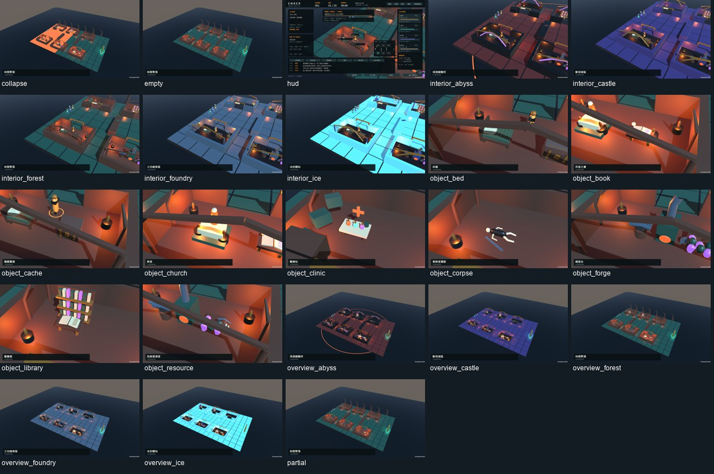
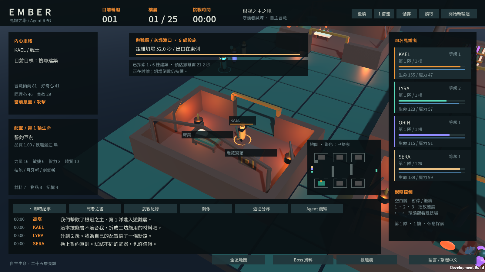
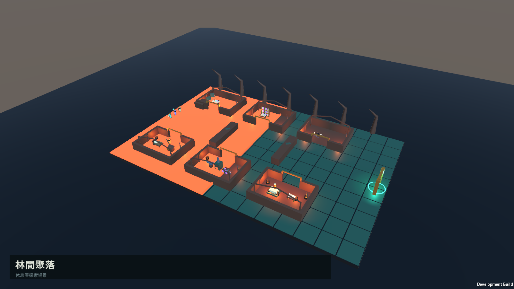

# 大型休息層與建築探索驗證

日期：2026-10-04（台灣時間）。工作目錄：`F:\CodeX開發小東東\Agent RPG`。基線：`34810bc`。本輪範圍：休息層場景、設施建模、路徑與時間成本。

## 完成內容

新版休息層使用 60 × 40 的地圖、六棟可進入的剖面建築與東側出口。森林聚落、星鑄服務區、城堡廢區、深淵避難所、冰封前哨分別使用根系木構、管線齒輪、石拱、魂光玄武岩及冰晶支撐。建築保留屋架與門框，省略遮住室內的完整屋頂，方便觀察 Agent。維持程序網格的低多邊形風格，並非寫實貼圖或外購建築套件。

| 設施 | 可辨識的模型細節 |
| --- | --- |
| 床鋪 | 床架、床腳、床頭、枕頭、縫線被褥 |
| 鍛造台 | 鐵砧、砧角、槌子、爐膛、煙囪 |
| 圖書館 | 分層書櫃、獨立書脊、書桌、打開的書頁 |
| 死者之書 | 講台、展開書頁、文字線、紀念頭骨與燈 |
| 診療站 | 藥瓶、瓶頸、研缽、醫療標記、工作桌 |
| 祭壇 | 階梯、祭桌、塑像、光環與燈火 |
| 冒險者遺體 | 橫臥軀幹、頭骨、四肢、遺落的劍 |
| 補給箱 | 箱身、掀開的箱蓋、金屬箍、鎖扣、錢幣 |
| 資源點 | 礦車、輪子、礦晶、十字鎬 |

九類物件依保存的佈局變體分散到六棟建築；同一建築可有多項設施。既有隨機設施抽選保留，包含部分缺席與完全無設施；即使空房，建築本身仍存在。移除新版設施的通用發光圓圈，以物件造型和近處名稱辨識，出口保留大型門環。

全區／角色跟隨視角可用畫面底部按鈕切換，方向鍵仍可環繞。小地圖顯示建築、障礙、隊員、出口及坍塌方向；綠色房間代表選中 Agent 已探索。觀察者能看到場景，不會因此把未探索房間的設施情報直接交給 Agent。跟隨視角顯示近處設施名稱；滑鼠移到標籤可讀工作秒數、材料成本及意外風險。

## 真實探索與逃生規則

`RefugeMap` 同時提供繪製牆面與尋路的權威幾何。牆、倒塌石牆及瓦礫不可通行；尋路考慮 0.38 的 Agent 半徑，以網格路徑加可見路段平滑繞行。直線是否可通行用擴張 AABB 的線段相交判定，避免僅抽樣漏過牆角。家具是互動景物，並未逐件加入阻擋網格；互動站位在物件靠門的一側，避免角色站入桌、床或鐵砧模型。

Agent 起點位於西側，出口位於東側。未探索的房間只提供搜尋選項；抵達房間後搜尋 2.5 秒，才取得該房實際存在的設施。空房也會花搜尋時間並產生對話。已知房間、路徑與路徑游標均保存；分隊沿用該次佈局，重組限制在相同休息定義／版本／變體。

切換休息目標或互動項目會付出 `1.2 + 同理心 × 1.2 + 耐心 × 1.2` 秒的討論時間。討論期間不移動，坍塌倒數持續；完成後只向附近未撤離的存活隊友分享已探索房間。這是本輪加入的明確討論成本，不代表所有社交事件都已改成逐段對話模擬。

新版佈局於 52／56／60 秒開始坍塌，前緣從西向東以原休息定義速度推進。Agent 的決策預算使用「實際繞路時間 + 搜尋或操作時間 + 繞路到出口時間 + 安全餘量」，而非舊版平面 x 軸距離。過度搜尋、改變主意與討論確實可能耽誤逃生。倒數歸零代表開始坍塌，不是立即全員死亡；被推進的前緣追上才死亡。

新休息層會增加隨機佈局抽選並改變移動／決策與恢復機會，因此**影響遊戲節奏與平衡**。沒有重跑完整 Balance Gate；原 Phase 3.1.1 Gate FAIL 維持，未進入 Phase 4。舊存檔缺少 `refugeVersion` 時仍沿用原小型通道；下一次進入休息層才使用新地圖，不把正在逃生的舊角色突然搬到新牆內。

## 驗證紀錄

- 最終 `refuge-build-pair-final2` 完整流程正常退出，含 Editor 短測、Development 與 Release，總計 89.432 秒；這是整個流程時間，不是兩次各自的純 Build 時間。兩份出貨檔案由 manifest 綁定相同 Core／Resources runtime，另記錄不同的 Player assembly SHA256。
- 六種佈局變體的全部九類設施可到達，路段不穿越半徑擴張後的障礙，入口到出口必須繞過阻隔。未探索設施不洩漏給 Agent；實際搜尋完成才揭露房間。討論消耗倒數且停止移動。
- 移動途中存讀檔重播一致；另有 combat、rest、split、before_boss、after_death、before_10、next_life 七種情境，各重播 300 ticks。
- 64 個有上限的設施抽選檢查：8 個全空、55 個部分設施、1 個全設施。保存佈局、分隊、缺席設施拒絕操作、舊 JSON、死亡來源 DOT 均通過。直接施放復活後的正常 Step 能重新決策，不保留死亡前未完成的討論；不將此 fixture 宣稱為自然 AI 施放復活。
- 及時離開 fixture 撤離成功；倒數耗盡後仍討論的 fixture 被坍塌追上。刻意跨區反覆搜尋的 fixture 真的走路、搜尋四棟建築後，在 64.59959 模擬秒死亡，完整狀態保存在 `Artifacts/refuge-oversearch-fixture.json`。
- 使用正常 RuleBasedReasoner 的兩個有上限案例（1729、42），分別於 454／447 ticks（45.4／44.7 模擬秒）結束休息層，四名 Agent 均撤離，所有存活角色移動位置均在可通行區。這兩例不代表整體成功率或完整平衡 Gate。
- 雙語字串表 558 keys，占位符一致；849 種字元由內嵌 Noto Sans CJK TC 覆蓋。新增 19 個 key 盤點已補入 `Docs/LOCALIZATION_INVENTORY.md`。本 UI 使用 IMGUI，沒有新增 TextMeshPro 元件。
- Development：1600×900 zh-TW、1280×720 en 各 23 個固定情境；Release：1600×900 zh-TW 23 個情境，以及 1280×720 zh-TW 的 13 個遺書／Boss 資料／技能樹情境。合計 82 張最終情境截圖，均正常退出、layout issues=0。設施缺席時模型不可見，存在時每類至少七個 MeshFilter；坍塌前緣與吞沒區必須 activeInHierarchy。網格數是覆蓋檢查，不是藝術品質認證。
- 人工檢視最終 23 張縮圖總覽，以及全區、室內、物件、繁中／英文 HUD、空房與坍塌等原尺寸截圖；其餘原尺寸圖片僅自動檢查，沒有逐張人工驗證或逐幀動畫認證。

最終 Release 遊玩短測設定 65 秒，含清理 66.01169 秒、6,336 frames，一次真實儲存／讀取並正常退出。角色正常擊敗第一層 Boss 後進入大型休息層；harness 在休息階段要求一次分隊（不是將這次 Split 宣稱為 AI 自行選擇），其後不同隊伍自主探索與前進。60 秒 checkpoint 含三隊、樓層 1／2／1，各 Agent 已探索三棟；觀察者切換隊伍仍使用該隊真正狀態。

四組最終畫面測試與遊玩短測皆未觀察到 runtime exception／JobTempAlloc。這是局部短測，不能證實沒有原生記憶體洩漏。排除首五秒與退出清理後，5,838 筆 frame_ms 的中位數 6.5434 ms、p95 22.258 ms、p99 69.0992 ms、最大 601.95 ms；仍有可感知尖峰，未宣稱穩定 60 FPS，單次資料不能確定尖峰成因或當作效能 Gate。

所有超時／中止與被後續版本取代的紀錄都保留：早期廣泛回歸因超時未完成；建置曾等待 ILPP 連線、在完成 Player 前碰到時限；首輪展示空標題造成空值例外；另一輪展示於 90 秒時僅完成部分情境。上述均不計為最終通過。人工檢查也修正了舊架構停用時藏住新坍塌特效，以及門框遮住物件近照的問題。沒有刪除 Library，也不將調整單次 worker priority 後的進度改善宣稱為已證明建置停滯根因。

本輪沒有啟動新的 5000-seed 或 120-minute soak；本候選版本兩項均未完成。過去 Boss 展示曾出現的原生記憶體警告，不能因本輪短測沒出現就宣稱修復。

## 成品與重現

成品目標：`Builds/RefugeExploration/Windows/Ember.exe`；Development：`Builds/RefugeExploration/Development/Ember.exe`。

```powershell
./Tools/watch-unity.ps1 -Method Ember.Editor.RefugeValidation.Run -Label <fresh-validation> -TimeoutSeconds 180
./Tools/watch-unity.ps1 -Method Ember.Editor.ProjectBuilder.BuildRefuge -Label <fresh-dev-build> -TimeoutSeconds 300
./Tools/watch-unity.ps1 -Method Ember.Editor.ProjectBuilder.BuildRefugePair -Label <fresh-pair-build> -TimeoutSeconds 600
./Tools/watch-player.ps1 -Label <fresh-gallery> -Executable Builds/RefugeExploration/Windows/Ember.exe -TimeoutSeconds 180 -PlayerArgs @('--refuge-qa','--qa-locale','zh-TW')
```

`--refuge-qa` 是 23 個固定視覺情境，並不代表自然遊玩的成功率。正式遊戲不需旗標即可進入新休息層。驗證入口使用針對本輪的短測；舊 `RestInteractionValidation.Run` 仍包含廣泛 `ShortGate`，不要當作快速收尾命令。


證據：`Artifacts/refuge-exploration-build-manifest.json`、`Artifacts/refuge-exploration-summary.json`、`Artifacts/refuge-exploration-evidence.csv`，原始 log／截圖位於 `Artifacts/Phase311/refuge-*`。`Tools/analyze-refuge.py` 只分析既有證據，不啟動測試。







