# Real Player gallery · 實機圖集

All images are real Windows Player captures. Several are scripted QA fixtures with controlled state, not uninterrupted natural-play recordings. Historical presentation captures are explicitly labeled; they are not evidence that the latest build passed those historical tests.

所有遊戲畫面均為實機截圖，未使用 AI 生成或修改遊戲內容。歷史版本、受控 fixture 與最新 Team Balance 畫面分開標示；範例狀態不代表自然遊玩通關。

## Four Agents, Boss and actionable ongoing threats

*Team Balance, final Windows Release QA*

## Astrolabe guardian model, Theme B

*Historical CombatArt QA*

## Rootcrown silhouette and environment

*Historical CombatArt QA*

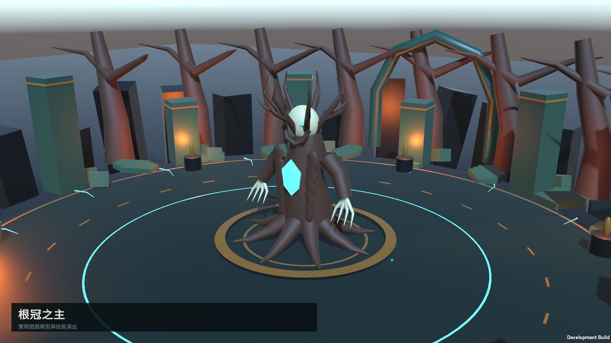

## Lightning skill effect fixture

*Historical CombatArt QA*

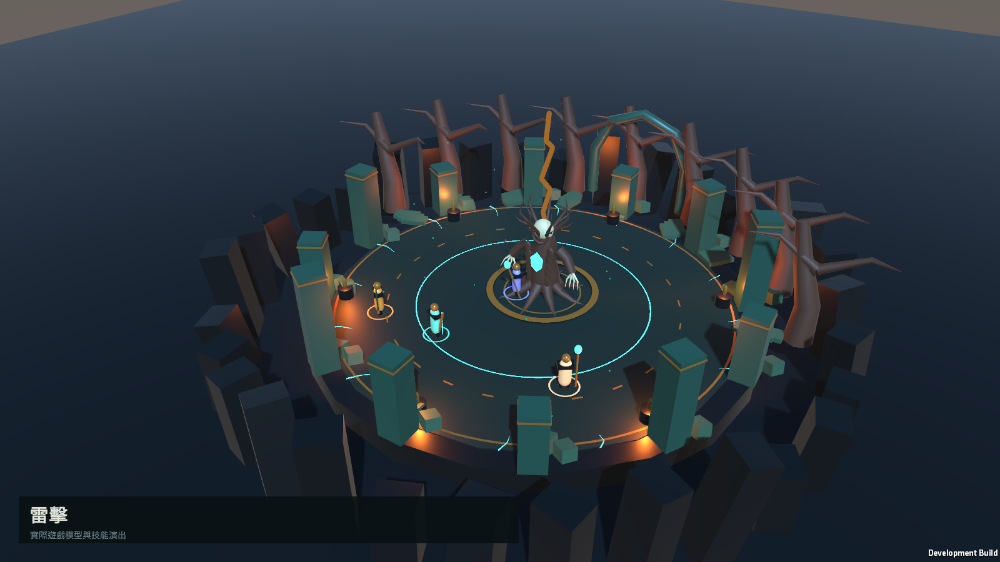

## Six-building forest refuge

*Historical RefugeExploration QA*

## Foundry interior and facilities

*Historical RefugeExploration QA*

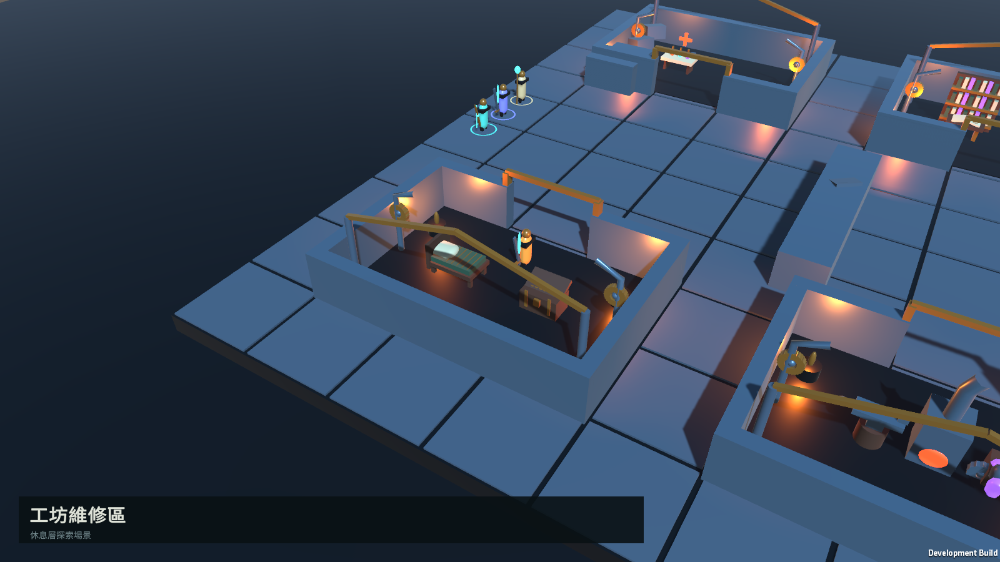

## Mind/status panels and observer camera

*Historical AgentInspection QA*

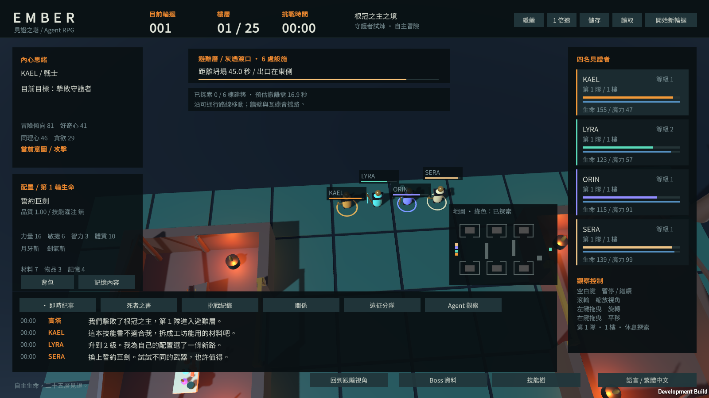

## Inventory details

*Historical AgentInspection QA*

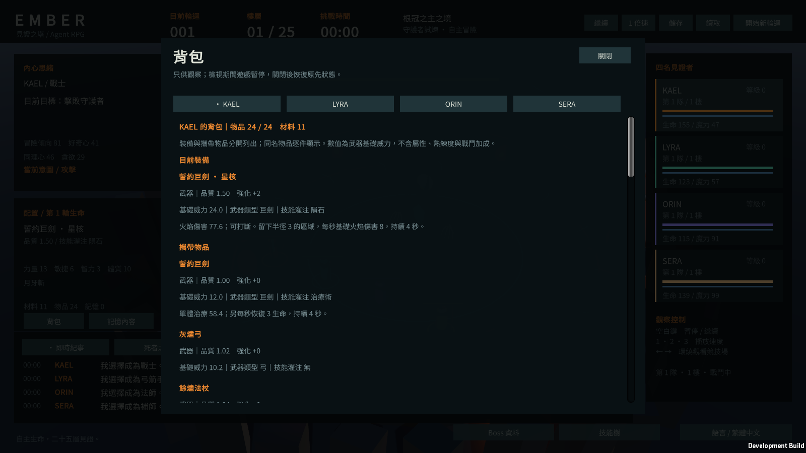

## Source-aware memory inspection

*Historical AgentInspection QA*

## Mage skill tree

*Team Balance, final Development QA*

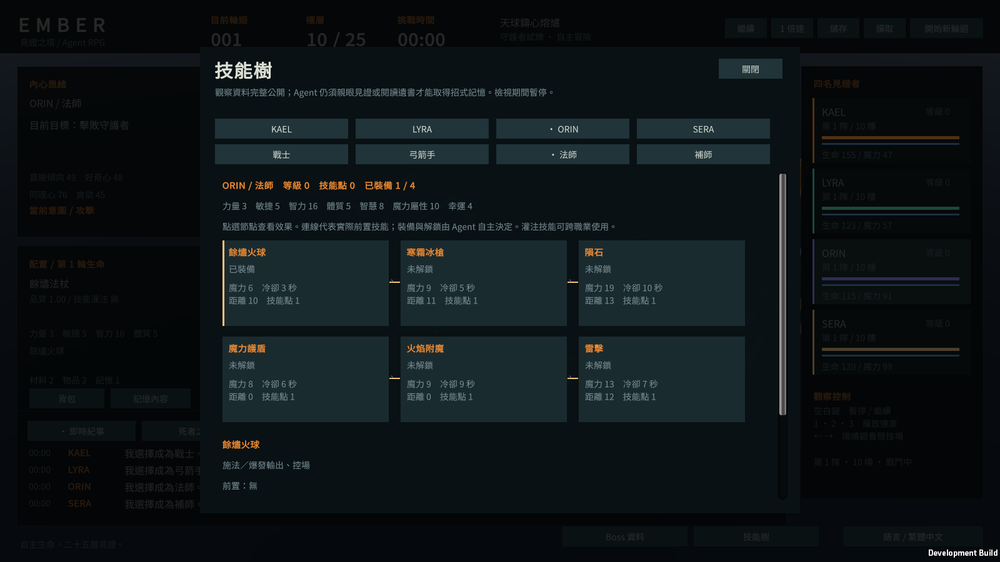

## Healer role and actual skill power

*Team Balance, final Development QA*

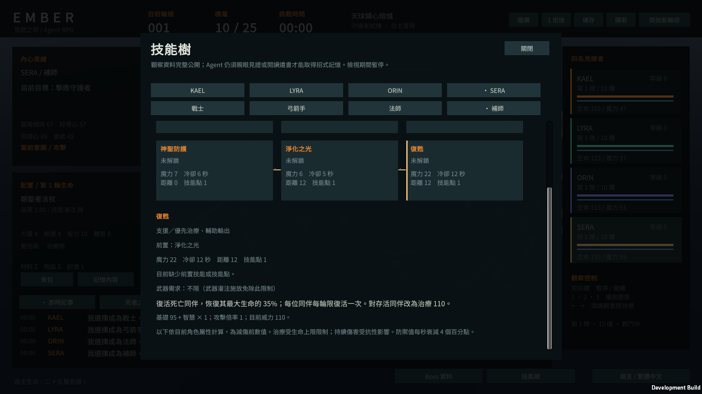

## Boss abilities and numeric information

*Team Balance, final Development QA*

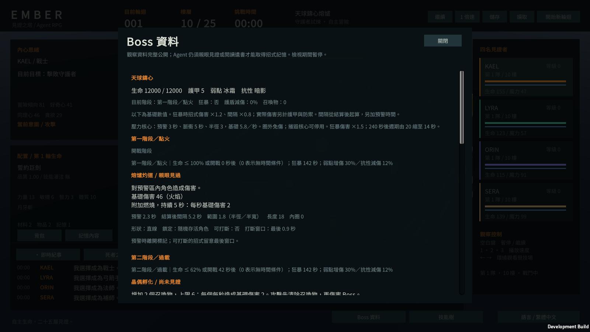

## Book of the Dead reader

*Team Balance, final Development QA*

## Directed relationship UI fixture

*Historical Phase 3.1.1 EXP2.1 QA*

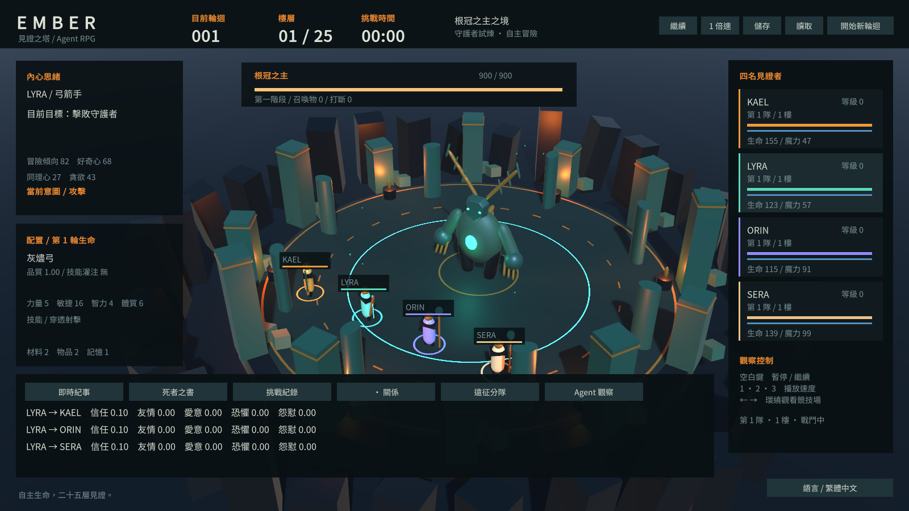

## Separate groups at different floors in Theme B

*Historical Phase 3.1.1 EXP2.1 QA*

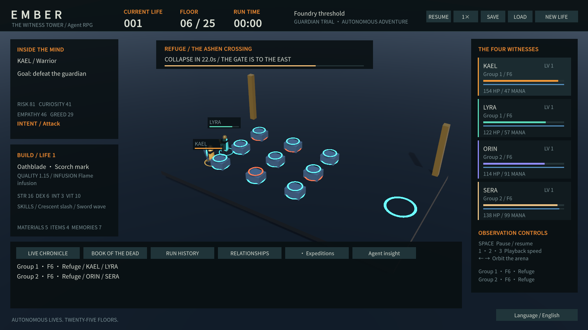

## Technical graphics

Architecture, decision and memory diagrams are explanatory graphics, not game screenshots. The balance plot uses only the latest controlled fixture data.

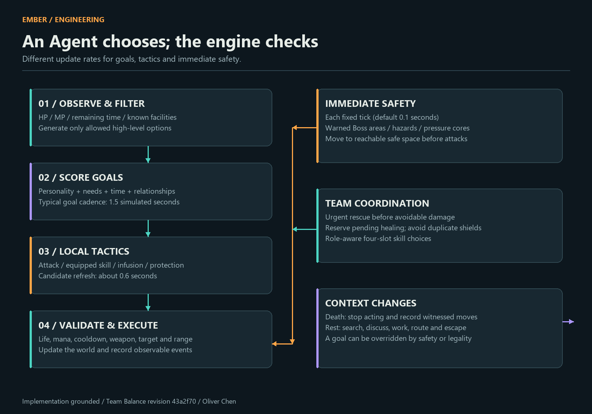

[README](../README.md) · [Evidence](ENGINEERING_EVIDENCE.md)
