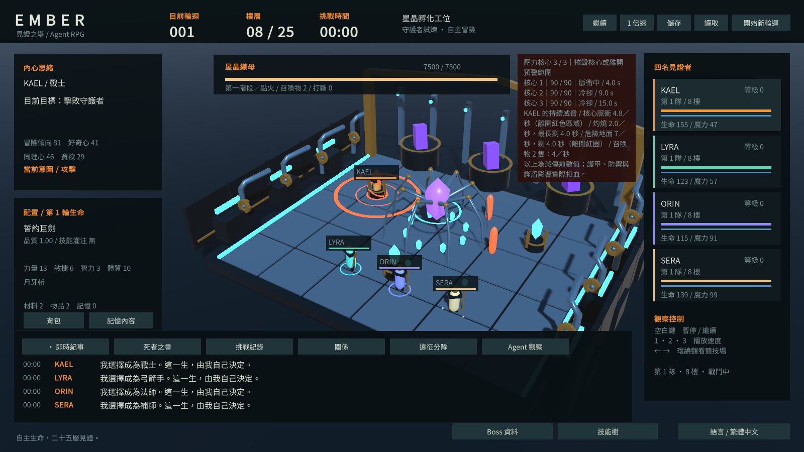
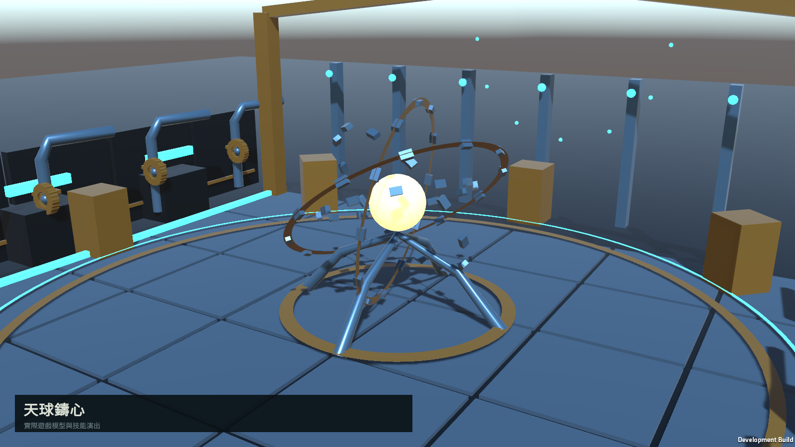
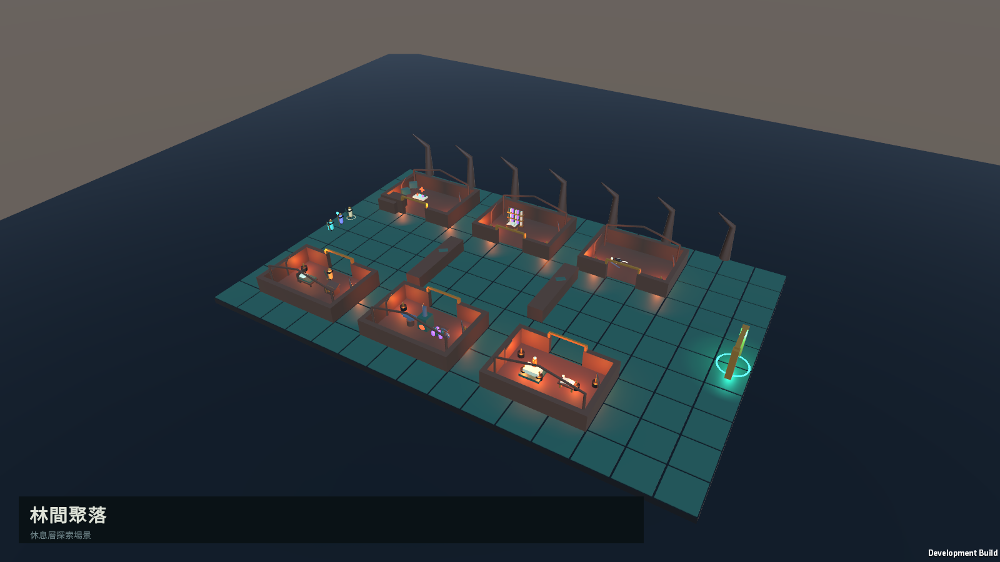
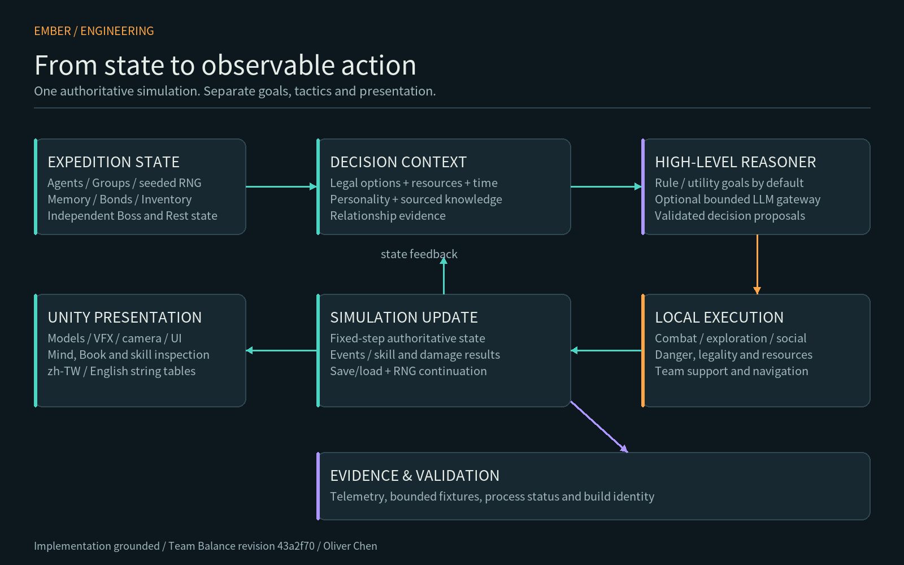

# EMBER
### Autonomous Agent Tower RPG · 見證之塔

Four autonomous adventurers fight, build relationships, leave memories behind, and attempt a 25-floor tower again.

**[繁體中文](README.md) · [Game gallery](Docs/SCREENSHOTS.md) · [Architecture](Docs/ARCHITECTURE.md) · [Decision logic](Docs/AGENT_DECISION_LOGIC.md) · [Algorithms](Docs/ALGORITHMS.md)**

> **Playable Research / Portfolio Build.** This is the original development repository, with its complete local commit history, source, real game captures and engineering evidence. Maintained by one author for portfolio review. The security-remediated Windows demo is publicly available. A valid action video and configured social preview are deferred with the author’s explicit approval; see [publication status](Docs/PUBLIC_REPOSITORY_SETTINGS.md).

**[Download Windows x64 demo](https://github.com/oliverchenOVO/ember-agent-rpg/releases/tag/v0.3.0-portfolio)** · Extract the entire zip, then run Ember.exe. [Package hashes and verification](Docs/DISTRIBUTION.md).

## Why EMBER?

- **Observe autonomous lives.** Four Agents choose goals and tactics; the player observes rather than issuing combat orders.
- **A tower with consequences.** The 25-floor simulation supports independent party progression, four classes, equipment, crafting and skill infusion.
- **Relationships change decisions.** Help, abandonment and shared events update directed bonds used in utility scoring.
- **Death leaves imperfect information.** Witnessed Boss abilities can enter the Book of the Dead; an Agent must read it in-game to inherit that knowledge.
- **Rest is a time-budget problem.** Search buildings, discover variable facilities, discuss plans, navigate obstacles—and leave before collapse.
- **Inspect the causes.** Mind, inventory, memories, skill details and Boss information are visible in zh-TW and English.

| Combat and named Boss models | Explore a dangerous refuge |
| --- | --- |
|  |  |
| [Bosses and visible pressure](Docs/AGENT_DECISION_LOGIC.md#combat) | [Navigation and escape budgets](Docs/ALGORITHMS.md#navigation) |

## Technical highlights

**Unity 6 / C# · Utility-based AI · Data-driven content · Seeded simulation · Source-aware memory · Telemetry**

The runtime separates high-level goals from local combat execution. A rule-based reasoner proposes a goal; the engine checks legality and applies safety, resource and team-coordination policies. An optional asynchronous LLM gateway proposes bounded decisions and falls back to local rules. It does not control animation or movement each frame.

Read the [architecture](Docs/ARCHITECTURE.md), [Agent action pipeline](Docs/AGENT_DECISION_LOGIC.md), [worked algorithm examples](Docs/ALGORITHMS.md), or [memory and relationship design](Docs/MEMORY_RELATIONSHIPS.md).

## Engineering evidence

Latest tested gameplay revision: **Team Balance / 43a2f70 / 2026-10-04**.

| Evidence | Observed result | Scope |
| --- | --- | --- |
| Mechanisms and regressions | 43 checks passed | 22 team checks + 21 pressure-core checks |
| Localization | 638 keys / 895 glyphs checked | zh-TW and English |
| Builds | Development + Windows Release succeeded | Bound to recorded runtime and assembly hashes |
| UI captures | 52 final captures checked | Two resolutions; no recorded layout issue or exception |
| Controlled party comparison | Six compositions, 36 matched pairs / 72 encounters | Two seeds; floors 6, 8 and 10; controlled gear and loadouts |

The mixed party's mean DPS rose by **20.3%** in this controlled fixture. This is not a full-progression win-rate claim: the no-healer party was still faster, and the healer-only party traded damage for support. [Data and interpretation](Docs/ENGINEERING_EVIDENCE.md).

**The latest full Balance Gate, 5000-seed simulation and 120-minute soak have not been rerun for this revision. Historical Balance Gate failure remains recorded.**

## Project status

- Core 1–25F scheduling, Agent systems and independent party states are implemented.
- Floors 6–10 have dedicated Theme B content, with prototype art and effects.
- Windows x64 portfolio prerelease: verified extracted package with official runtime security remediation.
- Balance, later-floor content, animation and audio are still being iterated.

[Known limitations](KNOWN_LIMITATIONS.md) · [Engineering case study](Docs/PORTFOLIO_CASE_STUDY.md) · [Evidence matrix](Docs/ENGINEERING_EVIDENCE.md).

## Open the project

Use Unity Hub to open `UnityProject`, then open `Assets/Scenes/Witness.unity`. The recorded gameplay build used Unity **6000.2.0f1**; use a patched Unity version for any new redistribution. See [distribution status](Docs/DISTRIBUTION.md). No API key is required for the default rule-based Agent.

Build and historical verification scripts are in `Tools`. **`Tools/build.ps1 -TestsOnly` includes 5000 seeds**; it is not a quick smoke test. This publication does not rerun that batch or the 120-minute soak. [Documentation index](Docs/INDEX.md).

## Author and use

**Designed and developed by Oliver Chen.** Development was AI-assisted, with architecture, design direction, validation criteria, integration, testing and iteration directed by the project author.

Materials are available for portfolio and educational review. **Not an open-source project. Contributions are currently closed.** This repository is maintained by the author; external code contributions are not part of the development workflow.

[Copyright](COPYRIGHT.md) · [Third-party notices](THIRD_PARTY_NOTICES.md) · [Media provenance](Media/Portfolio/PROVENANCE.json) · [Repository settings](Docs/PUBLIC_REPOSITORY_SETTINGS.md).
