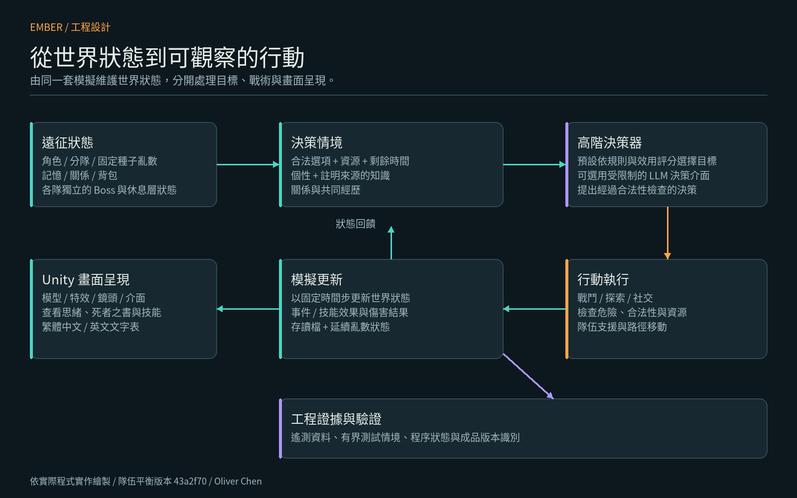

# EMBER · 見證之塔
### 以自主 Agent 為核心的 3D 爬塔 RPG

四名冒險者自行戰鬥、建立關係、留下記憶，並在死亡之後再次挑戰二十五層高塔。

**[English](README.en.md) · [實機圖集](Docs/SCREENSHOTS.md) · [系統架構](Docs/ARCHITECTURE.md) · [角色行動邏輯](Docs/AGENT_DECISION_LOGIC.md) · [演算法](Docs/ALGORITHMS.md)**

> **可遊玩的研究／作品集版本。** 這是原本的開發倉庫，保留完整開發提交紀錄、原始碼、實機畫面與工程證據，由作者單獨維護。Windows 展示版已公開，並完成官方安全修補與解壓短測；依作者明確同意，動態影片與 GitHub 社群預覽稍後補齊。詳見[公開狀態](Docs/PUBLIC_REPOSITORY_SETTINGS.md)。

**[下載 Windows x64 展示版](https://github.com/oliverchenOVO/ember-agent-rpg/releases/tag/v0.3.0-portfolio)** · 完整解壓縮後執行 Ember.exe。[成品雜湊與驗證](Docs/DISTRIBUTION.md)。

## 作品亮點

- **觀察自主生命：** 四名 Agent 自行選擇目標、技能與戰術，玩家透過介面觀察決策原因。
- **二十五層架構：** 四種職業、裝備、製作、技能灌注與分隊，各隊有獨立進度。
- **有因果的關係：** 施救、被拋下與共同經歷更新有向關係，進而影響候選行動分數。
- **有限的死亡記憶：** 遺書記錄真正見證的 Boss 招式；下一輪仍須在遊戲內閱讀才能取得資訊。
- **有風險的休息層：** 搜尋建築、發現不固定的設施、討論與繞路都消耗時間，可能趕不上撤離。
- **看得見的內部狀態：** 玩家可查看思緒、背包、記憶、技能數值與 Boss 資料，支援繁體中文／英文。

| Boss 造型與戰鬥演出 | 建築、探索與逃生 |
| --- | --- |
|  |  |

## 技術重點

**Unity 6／C#、效用決策、資料驅動內容、固定種子模擬、來源記憶、結構化遙測資料。**

高階決策器決定「做什麼」，低階執行器處理移動、閃避與技能。引擎負責檢查合法性、安全與資源，再協調全隊支援；可選的非同步 LLM 只能提出受限制的決策，失敗時回退本機規則，不逐幀控制角色。

閱讀：[架構與模組分工](Docs/ARCHITECTURE.md)、[行動流程](Docs/AGENT_DECISION_LOGIC.md)、[效用／路徑／預測治療演算法](Docs/ALGORITHMS.md)、[記憶與關係](Docs/MEMORY_RELATIONSHIPS.md)。

## 已有的工程證據

最新遊戲驗證版本為 **Team Balance／43a2f70／2026-10-04**：

| 項目 | 結果 | 範圍 |
| --- | --- | --- |
| 機制與回歸 | 43 項通過 | 隊伍 22 項、壓力核心 21 項 |
| 中文化 | 638 個鍵／895 個字元 | zh-TW 與英文 |
| 成品 | 開發版與 Windows 發佈版建置成功 | 記錄執行環境與程式組件的雜湊 |
| 介面 | 52 張最終截圖檢查 | 兩種尺寸，未記錄版面問題或例外 |
| 編成比較 | 六種編成、36 組配對／72 場 | 兩個固定種子，6／8／10 樓，受控裝備與技能 |

短測中混合隊平均輸出提升 **20.3%**，但無補師隊仍較快，四補師隊則降低輸出以回到支援定位。這不是完整爬塔勝率，也不是全職業平衡已認證。[分析與限制](Docs/ENGINEERING_EVIDENCE.md)。

**最新完整平衡驗收（Balance Gate）、5000 個種子樣本模擬與 120 分鐘穩定性測試尚未重新執行；歷史平衡驗收未通過的結果仍保留。**

## 開啟專案

以 Unity Hub 開啟 `UnityProject`，載入 `Assets/Scenes/Witness.unity`。現有成品的 Unity 版本為 **6000.2.0f1**；重新散布前須使用已修補版本或官方修補工具。[散布狀態](Docs/DISTRIBUTION.md)。預設規則決策不需要 API 金鑰。

`Tools/build.ps1 -TestsOnly` **會執行 5000 個種子樣本**，不是短測命令；本次公開不重新啟動該批次或 120 分鐘穩定性測試。[文件索引](Docs/INDEX.md)。

## 狀態與作者

1–25 樓流程、Agent 自主決策、分隊、記憶與關係系統已實作，6–10 樓有專屬 Theme B 內容；11–25 樓仍有程序化／佔位內容，動畫、音效與平衡持續調整。本機 Windows 成品可遊玩，Windows 展示版已完成修補與封裝短測，詳見散布文件。

[已知限制](KNOWN_LIMITATIONS.md) · [工程案例](Docs/PORTFOLIO_CASE_STUDY.md) · [網站與推甄介紹](Docs/PORTFOLIO_COPY.md)。

**Oliver Chen 設計與開發。** 開發使用 AI 協作；架構、設計方向、驗證標準、整合、測試與迭代由作者主導。

本倉庫用於作品展示與教學審閱，**不是開源專案，目前不接受外部程式碼貢獻**。著作權保留；第三方元件依各自授權。[著作權](COPYRIGHT.md) · [第三方聲明](THIRD_PARTY_NOTICES.md) · [圖片來源紀錄](Media/Portfolio/PROVENANCE.json) · [倉庫設定與公開狀態](Docs/PUBLIC_REPOSITORY_SETTINGS.md)。
